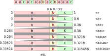
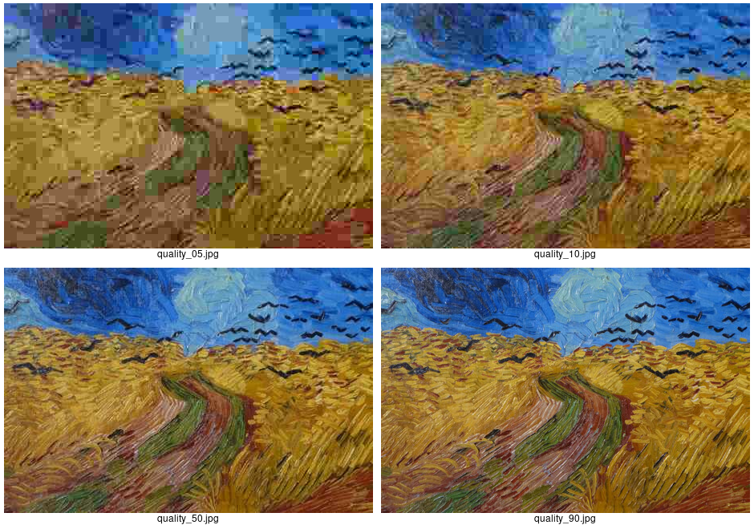
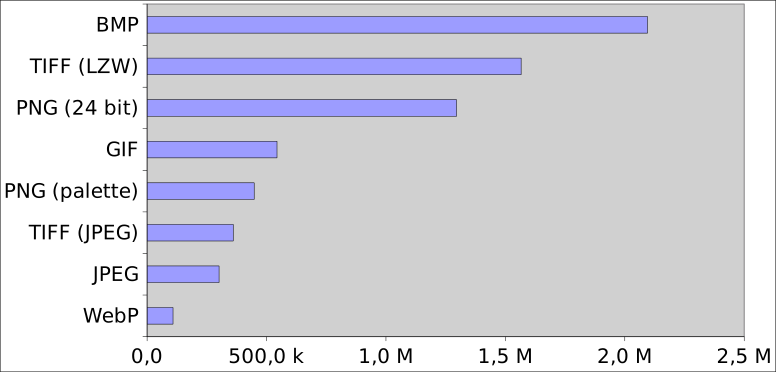

<center>

</center>

---

<center>

</center>

# Uso della codifica aritmetica

-   Una volta codificata la sequenza in un intervallo $[\alpha, \beta]$, questo intervallo è identificato *univocamente* da qualsiasi numero $\xi \in [\alpha, \beta]$.
-   Quindi una sequenza di lunghezza nota è associabile a un numero reale $\xi$.
-   Si dimostra che il numero di bit necessario per codificare questo numero $\xi$, se opportunamente scelto, tende a $S \times N$ quando $N \rightarrow \infty$.
-   Trasmettere il numero $\xi$ equivale a trasmettere quindi l'intero messaggio, ma la codifica è ottimale.
-   Oggi alla codifica aritmetica si preferiscono metodi basati sugli [asymmetric numeral systems](https://en.wikipedia.org/wiki/Asymmetric_numeral_systems) (Duda, 2014), che hanno le stesse capacità di compressione ma garantiscono esecuzioni più veloci (v. [Zstandard](https://en.wikipedia.org/wiki/Zstandard)).


# JPEG

-   È un algoritmo pensato per la compressione delle **immagini**.

-   Codifica i colori con 24 bit, ma internamente lavora nello spazio di colore Y C~B~ C~R~ anziché sRGB.

-   Decompone l'immagine in blocchi di 8×8 pixel, che «linearizza» in tre vettori monodimensionali (Y, C~B~, C~R~) di 64 elementi a cui applica la Discrete Cosine Transform (DCT), un tipo di trasformata di Fourier.

-   Ai coefficienti DCT è applicata una trasformazione del tipo $s \rightarrow \bigl[[s / q] \times q\bigr]$ che fa perdere informazione (algoritmo **lossy**); il livello di quantizzazione è detto *quality*, ed è compreso tra 0 e 100.

-   I coefficienti quantizzati sono compressi con Huffman o l'aritmetic coding.

# Quantizzazione { data-state="quantization-shannon" }

<center>
<div id="quantization-canvas" style="width:620px;height:480px;">
</div>
<div class="slidecontainer">
<input type="range" min="1" max="30" value="1" step="1" class="slider" id="quantization-slider">
<p id="quantization-value"></p>
</div>
</center>
    
<script type="text/javascript" src="./js/quantization.js"></script>
    
<script>
var quantization_slider = document.getElementById("quantization-slider");
var quantization_value = document.getElementById("quantization-value");

function redraw_quantized_signal() {
  var data = getQuantizationExampleData();
  var quant = quantization_slider.value * 1.0;
  var quant_data = quantize(data, quant);

  Plotly.newPlot('quantization-canvas', [{
    name: 'Original',
    y: data
  }, {
    name: 'Quantized',
    y: quant_data
  }], {
    xaxis: {range: [0, data.length]},
    yaxis: {range: [-35, 65]}
  });

  var entropy = shannon(quantize(getQuantizationExampleData(), quant));
  quantization_value.innerHTML = `Step: ${quant.toFixed(1)}, entropy: ${entropy.toFixed(2)} bit`;
}

quantization_slider.oninput = function() {
    redraw_quantized_signal();
}

document.addEventListener('quantization-shannon', function() {
    redraw_quantized_signal();
});
</script>


---

<center>

</center>

[Van Gogh, *Campo di grano con volo di corvi* (1890)]{style="float:right"}

# *Dictionary compressors*

-   Il teorema di Shannon fornisce un limite inferiore alla lunghezza di una serie compressa.
-   Esso però vale nel caso di una successione *casuale* di simboli: l'ordine in cui i simboli compaiono non conta! I compressori per cui il teorema di Shannon sono detti **compressori entropici**, o **statistici**.
-   I cosiddetti *dictionary compressors* cercano sequenze ripetute nella successione di simboli da comprimere.
-   I *dictionary compressors* sono da sempre molto usati nei formati grafici.

# Lempel-Ziv (1977)

-   Nel 1977, Abraham Lempel and Jacob Ziv proposero un algoritmo di compressione che è stato poi impiegato in molti formati grafici, da allora chiamato LZ77.

-   Esso sostituisce sequenze di dati con riferimenti a parti precedenti.

-   La sequenza di simboli è codificata in una sequenza di terne (*δ*, *L*, *s*), dove *δ* è un indice che dice di quanti simboli retrocedere, *L* è il numero di simboli da considerare, e *s* è il nuovo simbolo da aggiungere in coda.

-   L'algoritmo fissa un limite al numero di simboli da cercare a ritroso (che vanno tenuti in memoria): questo segmento è detto *window*.

---

<center>

</center>

# Lempel-Ziv (1978)

-   LZ77 ha lo svantaggio di richiedere di fissare una lunghezza della *window*: dimensioni diverse possono portare a performance differenti.

-   L'anno successivo (1978), Lempel & Ziv pubblicarono un nuovo articolo in cui descrivevano un nuovo algoritmo che non aveva questo grado di libertà.

-   Il nuovo algoritmo, chiamato LZ78, si basa su un «dizionario» di sequenze già codificate, che possono essere richiamate quando si trovano loro ripetizioni.

-   La sequenza compressa è formata da una lista di coppie (*k*, *s*), dove *k* fa riferimento a un elemento del dizionario oppure è 0 se non esistono corrispondenze, e *s* è il nuovo simbolo da mettere in coda.

---

<center>

</center>

# I formati grafici più diffusi

# Il formato [BMP](https://en.wikipedia.org/wiki/BMP_file_format#:~:text=The%20BMP%20file%20format%2C%20also,and%20OS%2F2%20operating%20systems.)

-   È un formato ideato da Microsoft per Windows e OS/2.

-   Il formato originale non prevedeva la compressione dei dati, ma con gli anni Microsoft ha aggiunto il supporto per RLE e Huffman coding.

-   Non supportando algoritmi di compressione avanzati, i suoi file sono generalmente molto grandi. ☹️

-   Permette di salvare file con *palette*, se si desidera comprimere ulteriormente il file. 😀

-   Non è troppo difficile da scrivere, soprattutto se evitate di comprimere i dati. 😀

# Il formato [GIF](https://en.wikipedia.org/wiki/GIF)

-   Usa la compressione LZW, che è una variante di LZ78: storicamente, è stato il primo formato di una certa diffusione a mostrare buoni livelli di compressione (1987).

-   Supporta solo immagini con *palette*, quindi è limitato a 256 colori. ☹️

-   A causa di problemi di brevetti legati alla compressione LZW (ora scaduti), nel 1995 è stato rilasciato il formato PNG, che usa un algoritmo di compressione (DEFLATE) basato su LZ77, all'epoca non gravato da brevetti.

-   Oggi è usato esclusivamente per la sua capacità di salvare semplici animazioni.

# Il formato [PNG](https://en.wikipedia.org/wiki/Portable_Network_Graphics)

-   Supporta immagini con *palette* (come il GIF), ma anche immagini a 24 bit e addirittura a 48 bit. 😀

-   Implementa una compressione più efficiente di GIF, ispirata all'algoritmo LZ77. 😀

-   Oggi è lo standard per le immagini su web, insieme al JPEG (v. in seguito).

# Il formato [JFIF](https://en.wikipedia.org/wiki/JPEG_File_Interchange_Format)

-   L'acronimo JFIF significa *JPEG File Interchange Format*.

-   È il formato ogirinale usato per salvare dati compressi usando l'algoritmo JPEG, anche se oggi altri formati supportano la compressione JPEG.

-   I file in formato JFIF hanno di solito estensione `.jpg` o `.jpeg`, anche se si possono trovare le estensioni `.jfif`, `.jfi` o `.jif`.

-   Il formato prevede anche un [metodo di compressione **lossless**](https://en.wikipedia.org/wiki/Lossless_JPEG), che è però poco usato.

# Il formato [TIFF](https://en.wikipedia.org/wiki/TIFF)

-   Creato dalla Aldus Corporation per gestire le immagini salvate da scanner (1986), in seguito acquisito dalla Adobe.

-   Il più versatile dei formati visti qui:

    -   Immagini multiple in uno stesso file 😀;
    -   Diversi schemi di compressione, sia **lossless** che **lossy** (RLE, LZW, JPEG, etc.) 😀;
    -   Supporta sia immagini a 24/48 bit che immagini con *palette* 😀;
    -   I colori possono essere memorizzati in vari spazi di colore, non solo sRGB 😀.

-   Molto diffuso nelle applicazioni (GIMP, Photoshop, etc.), non usato sul web.

# Il formato [WebP](https://en.wikipedia.org/wiki/WebP)

-   Creato da Google nel 2010.

-   Usa più algoritmi di compressione (LZW, JPEG, Huffman, …); l'effetto complessivo è un algoritmo **lossy**.

-   È il formato più efficiente tra quelli visti oggi: i suoi livelli di compressione sono eccellenti 😀.

-   Supportato su tutti i browser tranne sotto il Mac OS X (il supporto è stato aggiunto solo nel 2020 con Big Sur).

# Confronto dei formati

<center>

</center>

Dimensioni dei file contenenti l'immagine di «*Campo di grano con volo di corvi*».

# Approfondimento: manipolare i bit

# Dai *byte* ai *bit*

-   Gli algoritmi di compressione solitamente si basano sulla rappresentazione in bit dei numeri interi (in tipi come quelli del C++: `int`, `uint8_t`, `uint32_t`, etc.)

-   Abbiamo già visto di sfuggita l'importanza di esplorare i bit all'interno dei byte quando abbiamo descritto il formato [UTF-8](./tomasi-ray-tracing-03a.html#/codifica-utf-8).

-   Vi lascio come riferimento una serie di slide che mostrano come manipolare i singoli bit all'interno di un byte; non ci serviranno però durante le esercitazioni.

# Operazioni sui bit in C++ (1/2)

-   Le due operazioni `<<` e `>>` sono dette *bit shift operators*, e traslano i bit verso destra o sinistra (sono infatti indicate con (`shl` e `shr` in Pascal), eliminando quelli alle estremità:

    ```
    0b00101110 >> 1 = 0b00010111         0b00101110 << 1 = 0b01011100
    0b00101110 >> 2 = 0b00001011         0b00101110 << 2 = 0b10111000
    0b00101110 >> 3 = 0b00000101         0b00101110 << 3 = 0b01110000
    0b00101110 >> 4 = 0b00000010         0b00101110 << 4 = 0b11100000
    ```

-   L'operazione `x << 1` equivale a un prodotto per due, proprio come l'aggiunta di uno zero in fondo a un numero decimale equivale al prodotto per dieci (13 → 130).

-   In generale, `x << n` è matematicamente uguale a $2^n \times x$, e `x >> n` è uguale a $\lfloor 2^{-n} \times x\rfloor$.

# Operazioni sui bit in C++ (2/2)

-   Il C++ implementa gli operatori *logici* `&&` (*and*), `||` (*or*) e `^^` (*xor*):

    ```
    true  && true  == true     true  || true  == true     true  ^^ true  == false
    true  && false == false    true  || false == true     true  ^^ false == true
    false && true  == false    false || true  == true     false ^^ true  == true
    false && false == false    false || false == false    false ^^ false == false
    ```

-   Le operazioni `&`, `|` e `^` corrispondono all'*and*, *or* e *xor* logici `&&`, `||`, `^^`, ma sono fatte sui bit:

    ```
    0b00011001 &               0b00011001 |               0b00011001 ^
    0b10010101 =               0b10010101 =               0b10010101 =
    ----------                 ----------                 ----------
    0b00010001                 0b10011101                 0b10001100
    ```

# `write_float`

Due settimane fa avevo fornito questo codice C++ per estrarre i quattro byte di cui è composta la variabile `uint32_t double_word`:

```c++
// To interpret this code, you must remember that:
// -   uint32_t double_word is made by 8×4 = 32 bit
// -   0xFF is the uint32_t number
//
//     0b0000_0000_0000_0000_0000_0000_1111_1111

// Extract the four bytes in "double_word" using bit-level operators
uint8_t bytes[] = {
    static_cast<uint8_t>(double_word & 0xFF),         // Least significant byte
    static_cast<uint8_t>((double_word >> 8) & 0xFF),
    static_cast<uint8_t>((double_word >> 16) & 0xFF),
    static_cast<uint8_t>((double_word >> 24) & 0xFF), // Most significant byte
};
```

# Applicazione: `BitWriter`

```python
class BitWriter:
    "Write a sequence of bits into several 8-bit bytes"
    def __init__(self):
        self.seq_of_bytes = []
        self.bits_written = 0
        self.cur_byte = 0

    def push(self, value):
        self.cur_byte = (self.cur_byte << 1) + value
        self.bits_written += 1
        if self.bits_written == 8:
            self.seq_of_bytes.append(self.cur_byte)
            self.bits_written = 0
            self.cur_byte = 0
```

# Esempio di `BitWriter`

-   Questo codice usa `BitWriter` per scrivere una sequenza di 16 cifre binarie (0/1) in `output_stream`, e poi stampa i due byte che le contengono.

    ```python
    output_stream = BitWriter()
    for value in "1100 1001 0100 1101".replace(" ", ""):
        output_stream.push(int(value))

    print("Sequence of bytes produced by BitWriter:")
    for idx, value in enumerate(output_stream.seq_of_bytes):
        print("Byte #{0}: {1:3d} (0b{1:08b}, 0x{1:02x})".format(idx, value))
    ```

-   Output:

    ```text
    Sequence of bytes produced by BitWriter:
    Byte #0: 201 (0b11001001, 0xc9)
    Byte #1:  77 (0b01001101, 0x4d)
    ```

# `BitReader`

```python
class BitReader:
    "Decompose a sequence of bytes into binary digits"
    def __init__(self, seq_of_bytes):
        self.seq_of_bytes = seq_of_bytes
        self.cur_bit = 0

    def pop(self):
        result = (self.seq_of_bytes[0] & 0b10000000) >> 7

        self.seq_of_bytes[0] = self.seq_of_bytes[0] << 1
        self.cur_bit += 1
        if self.cur_bit == 8:
            self.cur_bit = 0
            self.seq_of_bytes = self.seq_of_bytes[1:]

        return result
```

# Esempio `BitReader`

-   Possiamo usare `BitReader` passandogli come input i due byte prodotti da `BitWriter` nell'esempio precedente:

    ```python
    input_stream = BitReader(output_stream.seq_of_bytes)
    print("Sequence of bits as decoded by BitReader:")
    for i in range(16):
        print(input_stream.pop(), end=" ")
    ```

-   Output:

    ```text
    Sequence of bits as decoded by BitReader:
    1 1 0 0 1 0 0 1 0 1 0 0 1 1 0 1
    ```

# Codifica aritmetica (1/5)

-   Vediamo ora come implementare l'algoritmo della codifica aritmetica per associare un intervallo $[\alpha, \beta]$ a una sequenza di byte.

-   L'algoritmo usa il concetto di «intervallo», quindi definiamo un tipo `Interval` che codifica una coppia di numeri reali:

    ```python
    from dataclasses import dataclass

    @dataclass
    class Interval:
        start: float = 0.0
        end: float = 1.0

        def __repr__(self):
            return f"[{self.start:.7f}, {self.end:.7f}]"
    ```

# Codifica aritmetica (2/5)

-   La codifica aritmetica ha bisogno di conoscere la probabilità con cui ogni byte compare nella sequenza.

-   Usiamo i `set` di Python per costruire una lista di tutti i simboli che compaiono nella sequenza, e poi usiamo `count` per contare ciascuna corrispondenza:

    ```python
    def probabilities(seq):
        symbols = set(seq)  # In our example, symbols == set("a", "b", "c")
        length = len(seq)   # Length of the sequence to compress
        return {x: seq.count(x) / length for x in symbols}
    ```

# Codifica aritmetica (3/5)

-   Una volta note le probabilità di ogni elemento, bisogna suddividere l'intervallo $[0, 1]$ secondo le probabilità di ciascun simbolo.

-   La funzione `intervals` invoca `probabilities` e costruisce un dizionario che associa ad ogni simbolo il proprio intervallo `Interval`:

    ```python
    def intervals(seq):
        probs = probabilities(seq)
        intervals = {}
        curpos = 0.0
        for s in sorted(probs.keys()):
            intervals[s] = Interval(start=curpos, end=curpos + probs[s])
            curpos += probs[s]

        return intervals
    ```

# Codifica aritmetica (4/5)

```python
def arithmetic_compression(seq):
    spans = intervals(seq)

    cur_span = Interval()
    for s in seq:
        print(f"Current interval: {cur_span}")
        subspan = spans[s]
        curlen = cur_span.end - cur_span.start
        new_span = Interval(
            start=cur_span.start + curlen * subspan.start,
            end=cur_span.start + curlen * subspan.end,
        )
        cur_span = new_span

    return cur_span
```

# Codifica aritmetica (5/5)

-   Verifichiamo il funzionamento del codice sulla nostra sequenza:

    ```python
    sequence = "aacacaabacbaaac"
    final_span = arithmetic_compression(sequence)
    print(f"Result for '{sequence}': {final_span}")
    ```

-   L'output è il seguente:

    ```text
    Current interval: [0.0000000, 1.0000000]
    Current interval: [0.0000000, 0.6000000]
    Current interval: [0.0000000, 0.3600000]
    …
    Current interval: [0.3099529, 0.3099586]
    Current interval: [0.3099529, 0.3099563]
    Result for 'aacacaabacbaaac': [0.3099554, 0.3099563]
    ```
