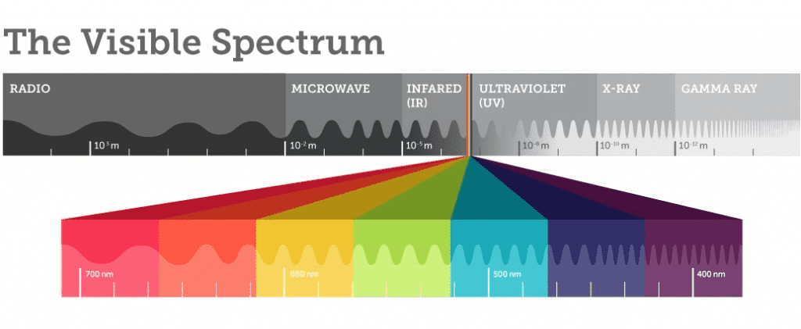
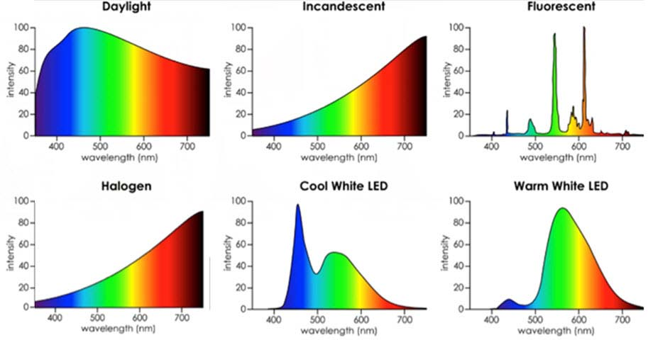
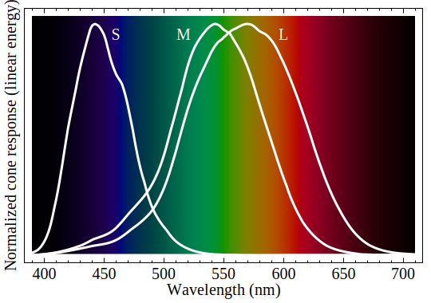
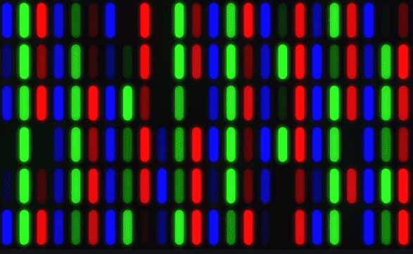

# Emissioni realistiche

-   La forma dello spettro **non** deve però far pensare che basti un
    valore di $\lambda$ per indicare un colore!

-   Gli spettri di emissione di oggetti del mondo reale possono essere
    molto complessi (v. lezione precedente):

    <center>
    {height="300px"}
    </center>

# SPD

-   Il termine *Spectral Power Distribution* (SPD) è un termine
    generico che indica la forma funzionale di una quantità dipendente
    da $\lambda$: SPD della radianza, SPD del flusso, SPD dell'emittanza, etc.

-   I grafici della slide precedente sono di fatto rappresentazioni di
    diverse SPD.

-   La percezione che il nostro occhio ha di un colore dipende dalla
    SPD del flusso che raggiunge i fotorecettori della retina
    sensibili al colore (*coni*).

# Percezione del colore

-   I fotorecettori presenti nell'occhio umano sono di due tipi:

    1.  **Bastoncelli**: cellule fotorecettrici fortemente sensibili
        all'intensità della luce (~100 milioni per occhio)

    2.  **Coni**: cellule fotorecettrici sensibili al colore della
        luce (~ 5 milioni per occhio)

-   I bastoncelli non sono sensibili alla SPD, e sono usati
    soprattutto in condizioni di scarsa luminosità.

-   Ovviamente a noi oggi interessano i coni!

---


# Tipi di coni

-   Esistono tre tipi di coni:

    1.  Tipo S (*short*): sensibile al blu
    2.  Tipo M (*medium*): sensibile al verde
    3.  Tipo L (*long*): sensibile al rosso

-   Ci sono più teorie che spiegano come il cervello combini le
    informazioni dei tre tipi di coni per rappresentare un colore.

---

{width=920px}

# Sistema XYZ

-   Teoria tristimolare dei colori: è sempre possibile codificare il
    colore percepito dall'occhio umano usando tre quantità scalari
    legate alla SPD:

    $$
    \begin{aligned}
    x &= \frac{
        \int_\lambda \mathrm{d}\lambda\,S(\lambda)\,X(\lambda)
    }{
        \int_\lambda \mathrm{d}\lambda\,Y(\lambda)
    },\\
    y &= \frac{
        \int_\lambda \mathrm{d}\lambda\,S(\lambda)\,Y(\lambda)
    }{
        \int_\lambda \mathrm{d}\lambda\,Y(\lambda)
    },\\
    z &= \frac{
        \int_\lambda \mathrm{d}\lambda\,S(\lambda)\,Z(\lambda)
    }{
        \int_\lambda \mathrm{d}\lambda\,Y(\lambda)
    }.
    \end{aligned}
    $$

# Sistema XYZ

-   Le curve $X(\lambda)$, $Y(\lambda)$ e $Z(\lambda)$ sono
    predefinite.
-   Definite dalla Commission Internationale de l'Éclairage (CIE)
-   Basate su esperimenti con volontari.
-   La costante di normalizzazione è sempre

    $$
    \int_\lambda \mathrm{d}\lambda\,Y(\lambda) \approx 106.856895\,\text{nm}.
    $$

# Curve X, Y, Z

```{.gnuplot format=svg dpi=600}
set xlabel "Wavelength [nm]"
set ylabel "Pure number"
plot "cie_data.txt" using 1:2 with lines lw 2 lt rgb "#3434ad" t 'X', \
     "" using 1:3 with lines lw 2 lt rgb "#34ad34" t 'Y', \
     "" using 1:4 with lines lw 2 lt rgb "#ad3434" t 'Z'
```

# Metamerismo cromatico

-   È possibile che due SED diverse portino agli stessi valori XYZ

-   In questo caso il colore dei due oggetti è indistinguibile
    all'occhio umano

-   Il fenomeno è detto *metamerismo cromatico*, e i due colori si
    dicono *metamerici*

-   Il metamerismo dipende dal tipo di illuminazione (sole, lampada a
    fluorescenza, luce laser, etc.)

# XYZ e RGB

-   Il sistema XYZ è basato sul funzionamento dell'occhio umano (coni)

-   Non è in generale adatto per la fabbricazione di hardware

-   Sistemi molto usati sono RGB (monitor) e CYMK (stampanti)

# Sistema RGB

-   Il sistema RGB usa tre quantità scalari per identificare un
    colore: rosso, verde, blu (**R**ed, **G**reen, **B**lue).

-   Basato sulla sintesi *additiva* dei colori, che è perfetta per i monitor (le stampanti usano la sintesi *sottrattiva*, e usano il sistema CYMK).

-   Legato al funzionamento dei vecchi televisori a tubo catodico e replicato sui moderni schermi LED e LCD

{height=200px}

# Da XYZ a RGB

$$
\begin{aligned}
\begin{pmatrix}R\\G\\B\end{pmatrix} &=
M_{\text{XYZ}\rightarrow\text{RGB}}\begin{pmatrix}X\\Y\\Z\end{pmatrix} =\\
&=
\begin{pmatrix}
+3.2404542& -1.5371385& -0.4985314\\
-0.9692660& +1.8760108& +0.0415560\\
+0.0556434& -0.2040259& +1.0572252
\end{pmatrix}
\begin{pmatrix}X\\Y\\Z\end{pmatrix}.\\
\end{aligned}
$$

# Colori RGB { data-state="rgb-colors" }

<table style="width:60%">
    <tr>
        <th>Red</th>
        <th>Green</th>
        <th>Blue</th>
    </tr>
    <tr>
        <td id="valRed"></td>
        <td id="valGreen"></td>
        <td id="valBlue"></td>
    </tr>
    <tr>
        <td id="red" style="height:50px;background-color:red"></td>
        <td id="green" style="background-color:green"></td>
        <td id="blue" style="background-color:blue"></td>
    </tr>
    <tr>
        <td>
            <input oninput="rgbChangeRed(this.value)" onchange="rgbChangeRed(this.value)" type="range" id="slideRed" name="slideRed" min="0" max="255" value="0">
        </td>
        <td>
            <input oninput="rgbChangeGreen(this.value)" onchange="rgbChangeGreen(this.value)" type="range" id="slideGreen" name="slideGreen" min="0" max="255" value="0">
        </td>
        <td>
            <input oninput="rgbChangeBlue(this.value)" onchange="rgbChangeBlue(this.value)" type="range" id="slideBlue" name="slideBlue" min="0" max="255" value="0">
        </td>
    </tr>
</table>
<div id="rgbChange" style="margin:auto;width:50%;height:50px"></div>

<script>
function rgbChangeRed(value) {
    document.getElementById('valRed').innerHTML = value;
    rgbChangeAll();
}
function rgbChangeGreen(value) {
    document.getElementById('valGreen').innerHTML = value;
    rgbChangeAll();
}
function rgbChangeBlue(value) {
    document.getElementById('valBlue').innerHTML = value;
    rgbChangeAll();
}
function rgbChangeAll() {
    var r = document.getElementById('valRed').innerHTML;
    var g = document.getElementById('valGreen').innerHTML;
    var b = document.getElementById('valBlue').innerHTML;
    document.getElementById('rgbChange').style.backgroundColor = "rgb(" + r + "," + g + "," + b + ")";
}

document.addEventListener('rgb-colors', function() {
    document.getElementById('valRed').innerHTML = 0;
    document.getElementById('valGreen').innerHTML = 0;
    document.getElementById('valBlue').innerHTML = 0;
    rgbChangeAll();
});
</script>

# Da $L_\lambda$ a RGB

-   Equazione del rendering espressa per $L_\lambda$
    $$
    \begin{aligned}
    L_\lambda(x \rightarrow \Theta) = &L_{e,\lambda}(x \rightarrow \Theta) +\\
    &\int_{\Omega_x} f_{r,\lambda}(x, \Psi \rightarrow \Theta)\,L_\lambda(x \leftarrow \Psi)\,\cos(N_x, \Psi)\,\mathrm{d}\omega_\Psi.
    \end{aligned}
    $$

-   Equazione espressa per $X$ (lo stesso per $Y$ e $Z$):
    $$
    \begin{aligned}
    x = \frac1k \int_\lambda\,\mathrm{d}\lambda X(\lambda)\, L_\lambda(x \rightarrow \Theta).
    \end{aligned}
    $$

# Operazioni sui colori

-   Per valutare l'integrale nell'equazione del rendering occorrono queste operazioni:

    -   Somma di densità di radianza: $L_\lambda^{(1)} + L_\lambda^{(2)}$
    -   Prodotto di densità di radianza per uno scalare: $\xi\,L_\lambda$

-   Le due operazioni sono lineari

-   La definizione di $X$, $Y$, $Z$ è lineare (integrale)

-   La conversione a RGB è lineare (matrice)

-   Quindi le due operazioni (somma e prodotto per scalare) possono essere implementate direttamente sui valori RGB.

# Esempio (1/2)

$$
\begin{aligned}
L_\lambda &= \alpha L_\lambda^{(1)} + \beta L_\lambda^{(2)},\\
\int_\lambda\mathrm{d}\lambda\,X(\lambda)\,L_\lambda &= \int_\lambda\mathrm{d}\lambda\,X(\lambda)\,\bigl(\alpha L_\lambda^{(1)} + \beta L_\lambda^{(2)}\bigr),\\
\int_\lambda\mathrm{d}\lambda\,X(\lambda)\,L_\lambda &= \alpha\int_\lambda\mathrm{d}\lambda\,X(\lambda)\, L_\lambda^{(1)} +
  \beta \int_\lambda\mathrm{d}\lambda\,X(\lambda)\,L_\lambda^{(2)},\\
X &= \alpha X^{(1)} + \beta X^{(2)},\\
\end{aligned}
$$
e quindi operazioni lineari sulla radianza si traducono in operazioni lineari sulle componenti di colore $X$, $Y$ e $Z$.

# Esempio (2/2)

$$
\begin{aligned}
M_{\text{XYZ}\rightarrow\text{RGB}}\begin{pmatrix}X\\Y\\Z\end{pmatrix} &=
M_{\text{XYZ}\rightarrow\text{RGB}}\begin{pmatrix}\alpha X^{(1)} + \beta X^{(2)}\\\alpha Y^{(1)} + \beta Y^{(2)}\\\alpha Z^{(1)} + \beta Z^{(2)}\end{pmatrix},\\
\begin{pmatrix}R\\G\\B\end{pmatrix} &=
\alpha M_{\text{XYZ}\rightarrow\text{RGB}}\begin{pmatrix}X^{(1)}\\Y^{(1)}\\Z^{(1)}\end{pmatrix} +
\beta M_{\text{XYZ}\rightarrow\text{RGB}}\begin{pmatrix}X^{(2)}\\Y^{(2)}\\Z^{(2)}\end{pmatrix},\\
R &= \alpha R^{(1)} + \beta R^{(2)},\\
\end{aligned}
$$
e quindi la linearità è preservata anche per $R$, $G$ e $B$.

# Risposta dei monitor

-   Per specificare l'intensità di ciascuno dei canali RGB, una scheda
    grafica moderna richiede un valore *intero* da 0 a 255;

-   La potenza emessa dai punti di uno schermo non varia linearmente:
    $$
    \text{output} = \text{input}^\gamma,
    $$

    dove $\text{input}, \text{output} \in [0, 1]$, e $\gamma$ è un parametro caratteristico del dispositivo.

# Andamento di $\gamma$

```{.gnuplot format=svg dpi=600}
set xlabel "Normalized input"
set ylabel "Normalized output"
set key left top
plot [0:1] x with lines t "γ = 1.0" lt rgb "#ad3434", \
           x**1.6 with lines t "γ = 1.6" lt rgb "#34ad34", \
           x**2.2 with lines t "γ = 2.2" lt rgb "#3434ad"
```

# Calibrazione dei monitor


$$
\text{value} = \frac12^\gamma \quad\Rightarrow\quad \gamma = \frac{\log 1/2}{\log(\text{value})}
$$


# Calibrazione dei monitor  { data-state="monitor-calibration-state" }

<table>
    <tr>
        <td>
            <canvas
                id="monitor-calibration"
                width="300px"
                height="300px"
                style="image-rendering: pixelated">
            </canvas>
        </td>
        <td>
            <canvas
                id="gamma-plot"
                width="300px"
                height="300px">
            </canvas>
        </td>
    </tr>
</table>

<div class="slidecontainer">
  <input type="range" min="0.0" max="1.0"
    value="0.5" step="0.01" class="slider" id="gamma-slider">
  <p id="gamma-value"></p>
</div>

<script>
var checker_canvas_width;
var checker_canvas_height;
var checker_canvas_ctx;

var gamma_canvas_width;
var gamma_canvas_height;
var gamma_canvas_ctx;

var gamma_slider = document.getElementById("gamma-slider");
var gamma_value = document.getElementById("gamma-value");
var black_white_checkers;
gamma_value.innerHTML = gamma_slider.value;

function calc_gamma(val05) {
    return Math.log(0.5) / Math.log(val05);
}

function redraw_gamma() {
  var val = (gamma_slider.value * 255.0).toFixed(0);

  // Grey border around the image
  checker_canvas_ctx.fillStyle = `rgb(${val}, ${val}, ${val})`;
  checker_canvas_ctx.fillRect(0, 0, checker_canvas_width, checker_canvas_height);

  // Checkered image
  var cornerx = (checker_canvas_width - black_white_checkers.width) / 2;
  var cornery = (checker_canvas_height - black_white_checkers.height) / 2;
  checker_canvas_ctx.drawImage(black_white_checkers,
                               cornerx, cornery);

  // Gamma plot
  gamma_canvas_ctx.clearRect(0, 0, gamma_canvas_width, gamma_canvas_height);

  var gamma = calc_gamma(gamma_slider.value * 1.0);
  const numOfPoints = 30;
  gamma_canvas_ctx.beginPath();
  gamma_canvas_ctx.moveTo(0, gamma_canvas_height);
  for(i = 1; i <= numOfPoints; i++) {
    gamma_canvas_ctx.lineTo(gamma_canvas_height * i / numOfPoints,
                            gamma_canvas_height * (1.0 - Math.pow(i * 1.0 / numOfPoints, gamma)));
  }
  gamma_canvas_ctx.stroke();
}

function refresh_gamma_text(val) {
  var gamma = calc_gamma(val);
  gamma_value.innerHTML = `Value: ${val.toFixed(2)} (${(val * 255.0).toFixed(0)}), γ: ${gamma.toFixed(2)}`;
  redraw_gamma();
}

gamma_slider.oninput = function() {
  refresh_gamma_text(this.value * 1.0);
}

document.addEventListener('monitor-calibration-state', function() {
  var canvas = document.getElementById("monitor-calibration");
  checker_canvas_ctx = canvas.getContext("2d");
  checker_canvas_width = canvas.width;
  checker_canvas_height = canvas.height;

  canvas = document.getElementById("gamma-plot");
  gamma_canvas_ctx = canvas.getContext("2d");
  gamma_canvas_width = canvas.width;
  gamma_canvas_height = canvas.height;

  black_white_checkers = new Image();
  black_white_checkers.src = "./media/black-white-checkers.png";
  black_white_checkers.addEventListener("load", redraw_gamma, false);

  refresh_gamma_text(0.5);
});
</script>

# Risposta dei monitor

-   Una volta ottenuta una terna RGB di numeri reali, per pilotare un monitor occorre convertirla in una cosiddetta «[terna sRGB](https://en.wikipedia.org/wiki/SRGB)».
-   La conversione è parametrizzata da $\gamma$, e **non è lineare**.
-   Quanto abbiamo visto per la conversione $L_\lambda \rightarrow (X, Y, Z) \rightarrow (R, G, B)$ non si applica quindi a sRGB.

# Conversione da RGB a sRGB

-   La conversione da RGB a sRGB è esprimibile con la formula
    $$
    \begin{aligned}
    r &= \left[k\,R^\gamma\right],\\
    g &= \left[k\,G^\gamma\right],\\
    b &= \left[k\,B\gamma\right],\\
    \end{aligned}
    $$
    dove $[\cdot]$ è indica l'arrotondamento a intero, e $k$ è una costante di normalizzazione.
-   Determinare un «buon» valore per $k$ è critico!

# Determinazione di $k$

-   Se i valori R, G e B fossero compresi nell'intervallo $[0, 1]$, allora basterebbe porre $k = 255$.
-   Ma l'intervallo dei possibili valori di R, G e B è infinito:
    -   Dipende dall'unità di misura usata per $L_\lambda$;
    -   Dipende dal tipo di scena (astronave vicino a una supernova? grotta?)
-   Lo standard CIE XYZ definisce una normalizzazione di riferimento in termini di un colore standard, il *D65*, che corrisponde all'emissione di un corpo nero a 6500 K (più o meno l'emissione del cielo in una giornata limpida).
-   Vedremo meglio questo punto quando avremo discusso il salvataggio di immagini.

# Emissione di schermi

Esistono vari tipi di schermi (tubi catodici, LED, etc.), e gli
spettri di emissione possono essere diversi:

{height=400px}

Non spenderemo troppo tempo su questo per motivi di tempo.


# Lezioni imparate oggi

---

-   Mai dimenticarsi che le misurazioni fisiche passano da uno strumento: occorre conoscerne le caratteristiche e le non-idealità!
-   Semplificare il più possibile: invece di trattare $L_\lambda$, usiamo $R$, $G$ e $B$.
-   Il mondo è *complicato*!
