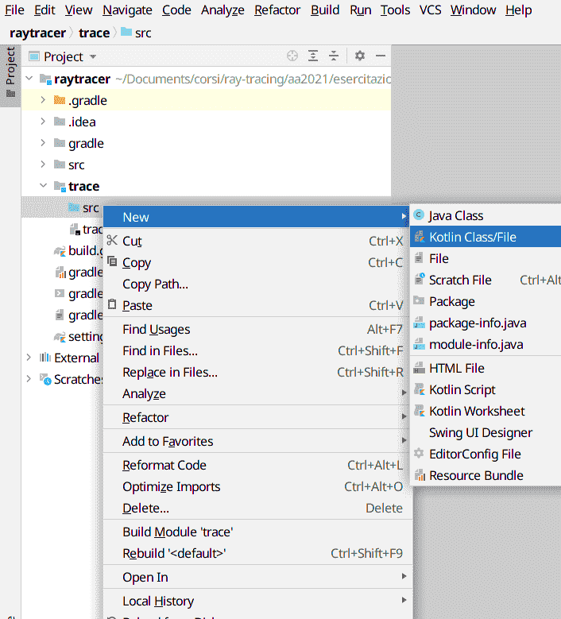
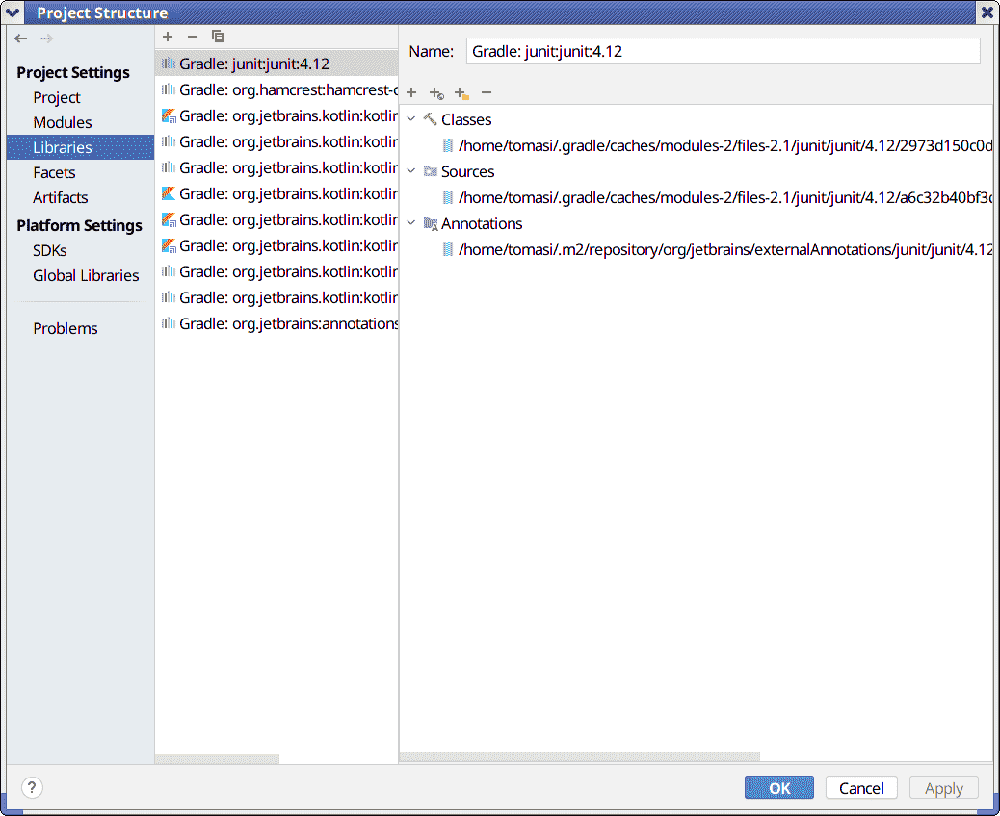
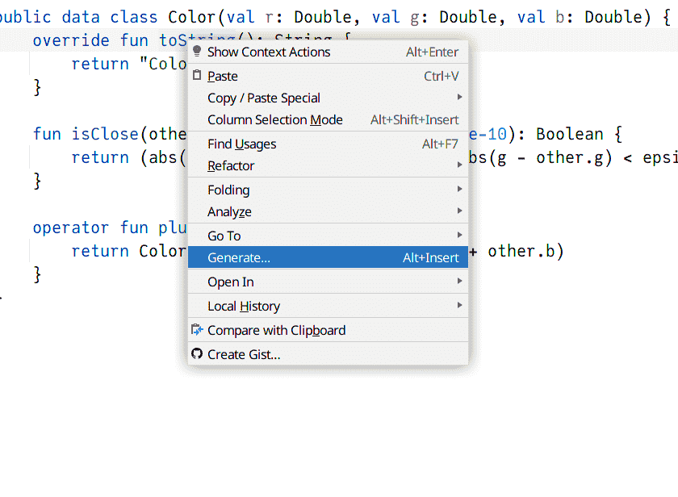
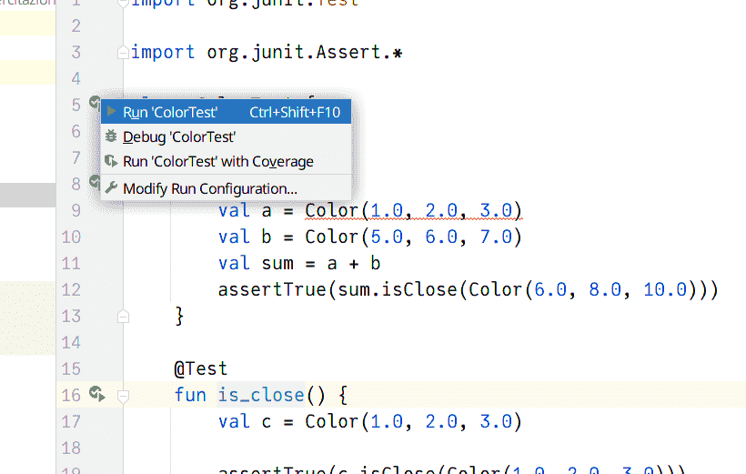

<asciinema-player src="cast/color-test-python.cast" rows="27" cols="94" font-size="medium"></asciinema-player>

# Verifiche su floating point

-   Nei test che scriveremo dovremo usare operazioni logiche e di confronto (in Python: `==`, `<`, `>`, `<=`, `>=`, etc.)

-   Occorre prestare molta attenzione ai numeri floating point!

    <asciinema-player src="cast/floating-point-python.cast" rows="15" cols="80"
        font-size="medium"></asciinema-player>

# Accorgimenti per floating point

-   Evitate dei test che coinvolgano numeri con parti decimali (es., `2.1`, `5.09`)
-   Numeri interi piccoli (es., `16.0`) sono codificati senza arrotondamenti…
-   …quindi nei test, se possibile, usate numeri floating point interi (come abbiamo fatto per la classe `Color` in Python)
-   Per i casi in cui non è possibile, definite una funzione `are_close`:

    ```python
    def are_close(x, y, epsilon = 1e-10):
        return abs(x - y) < epsilon

    x = sum([0.1] * 10)       # Sum of the values in [0.1, 0.1, ..., 0.1]
    print(x)                  # Output: 0.9999999999999999
    assert are_close(1.0, x)  # This test passes successfully
    ```

# Funzioni di supporto ai test

-   Nel nostro codice Python, per verificare la corrispondenza tra due colori abbiamo usato `==`, che funziona perché abbiamo specificato numeri interi:

    ```c++
    assert (color1 + color2) == Color(6.0, 8.0, 10.0)
    assert (2 * color1) == Color(2.0, 4.0, 6.0)
    ```

-   Però $\pi$ compare spesso nei calcoli radiometrici!

-   Definite una funzione che confronti due `Color` come i floating-point:

    ```python
    def are_colors_close(a, b):
        return are_close(a.r, b.r) and are_close(a.g, b.g) and are_close(a.b, b.b)

    assert are_colors_close(color1, color2)
    ```

# Lavoro in gruppo

-   Da oggi lavorerete in gruppo: ciascuno di voi dovrà scegliere quale parte di codice implementare.

-   Inizieremo ad usare le caratteristiche più avanzate di Git per gestire i **conflitti**, ossia le situazioni in cui una parte di codice viene modificata contemporaneamente da più persone.

-   Vediamo un esempio pratico di conflitto per un semplice codice Python.

---

<asciinema-player src="cast/git-conflicts-96x27.cast" cols="96" rows="27"  font-size="medium"></asciinema-player>

# *Merge commit*

<center>

</center>

# Tipi di conflitti

1.  Due sviluppatori stanno implementando la stessa funzionalità:
    -   Si sceglie una delle due implementazioni
    -   Si fondono insieme
2.  Due sviluppatori implementano funzionalità separate nello stesso punto del codice:
    -   Se possono coesistere, si mantengono insieme (è il caso del video precedente)
    -   Se non possono, si separano in due file diversi
3.  Due sviluppatori implementano due funzionalità incompatibili:
    -   Decidono quale delle due funzionalità vada mantenuta e quale no…
    -   …oppure uno dei due si licenzia!

# Guida per l'esercitazione

# Guida per l'esercitazione

1.  Create una directory per il vostro progetto (qui useremo il nome `raytracer`).

2.  Strutturare il progetto nel modo seguente:

    -   Una libreria che implementi `Color` e le operazioni su di esso;
    -   Un eseguibile da linea di comando, che per il momento stampi solo `Hello, world!`, ma che possa usare la libreria;
    -   Una serie di test automatici sul tipo `Color`.

3.  Registrare il progetto su GitHub e aggiungere i membri del gruppo.

4.  Implementare la classe `Color` e i test.

5.  Useremo la solita stanza Gather  [LaboratorioRayTracing](https://gather.town/app/CgOtJvyNfVKMIQ9e/LaboratorioRayTracing).


# Lavoro in gruppo

-   In ogni gruppo, solo **uno** di voi dovrebbe creare lo scheletro del progetto, creare la pagina GitHub e salvarlo.

-   Gli altri membri diventeranno collaboratori del progetto (v. slide seguente).

-   Pensate a un modo per suddividere il lavoro tra membri del vostro gruppo:

    1.  Somma/differenza di due colori;
    2.  Prodotto tra due colori, e prodotto colore-scalare;
    3.  Funzione `are_colors_close`;
    4.  Test.

---

<center>

</center>


# Grafico delle dipendenze

```{.graphviz}
graph "" {
    lib [label="library" shape=ellipse];
    exec [label="executable" shape=box];
    test [label="tests" shape=box];
    lib -- exec;
    lib -- test;
}
```

-   Per *libreria* intendiamo un insieme di funzioni/classi (un file `.a` in C++, un file `.dll` in C\#, un insieme di classi in Kotlin; per Julia la struttura di un package è già sufficiente)
-   Oggi non faremo nulla con l'eseguibile: basta un «Hello, world!»
-   I test sono invece molto importanti già da oggi!

# Caratteristiche di `Color`

-   Tre campi `r`, `g`, `b` di tipo floating-point (non perdete tempo a definire `GetR`/`SetR` e simili: il tipo `Color` deve essere agile da usare!);
-   Metodo `Color.is_close` o funzione `are_close`/`are_colors_close` per verificare se due colori sono simili (utile nei test);
-   Somma e differenza tra colori;
-   Prodotti colore-colore e colore-scalare.

# Uso della memoria

-   Nella maggior parte dei linguaggi c'è differenza tra *value* e *reference types*.

-   I *value types* sono valori a cui si può accedere direttamente, e sono sempre allocati sullo *stack*: sono molto veloci da usare, ma non possono occupare troppa memoria (alcuni kB al massimo).

-   I *reference types* sono dei puntatori al dato attuale, e possono essere sia sullo *stack* che nello *heap*; in quest'ultimo caso possono occupare tutta la memoria che vogliono, ma sono più lenti da leggere e scrivere.

-   Fanno eccezione i linguaggi basati su JVM (Java, Kotlin, Scala, etc.), per cui esistono solo *reference types* (ma la JVM può autonomamente convertire variabili in *value types* se capisce che è conveniente).

---

<center>

</center>

---

# Esempio in C++

```c++
#include <iostream>

int main() {
    int a{};            // Allocated on the stack
    int * b = new int;  // Allocated on the heap

    a = 15;   // This is fast
    *b = 16;  // This is slower
    
    std::cout << a << ", " << *b << "\n";
}
```

# Dimensione dello stack

-   Per programmi C/C++/Fortran/Julia, la dimensione è fissata dal sistema operativo. Sotto sistemi Posix (Linux/Mac OS X), potete conoscerne il valore in KB col comando `ulimit -s`:

    ```text
    $ ulimit -s
    8192
    ```

    Il valore di 8 MB è caratteristico di Linux; per i Mac è 0,5 MB.

-   La piattaforma .NET (Visual Basic, C\#) usa uno stack di 1 MB.

-   La piattaforma JVM (Java, Kotlin) usa uno stack di 1 MB, che è però usato solo per i tipi primitivi (interi, booleani, numeri floating-point).

# Value types

-   La classe `Color` è molto piccola: richiede memoria per 3 numeri floating-point. È quindi logico definirla come un *value type*.

-   A seconda del linguaggio, l'uso di un *value type* richiede accorgimenti diversi:

    -   In C++, usate `struct` oppure `class` (è uguale), ma quando la userete nei codici/test evitate `new`/`delete`;
    -   In C\#, usate `struct` (value type), ma non `class` (reference type);
    -   In Pascal, usate `object` o `record`, ma non usate `class`;
    -   In Nim, usate `object`, ma non usate `ref object`;
    -   In Julia, usate il package [`StaticArrays`](https://juliaarrays.github.io/StaticArrays.jl/stable/).

# Test (1)

-   Creazione di colori e funzione `is_close`:

    ```python
    col1 = Color(1.0, 2.0, 3.0)
    assert col1.is_close(Color(1.0, 2.0, 3.0))
    ```

-   Verifica che `is_close` fallisca (ossia ritorni `False`) quando è necessario:

    ```python
    assert not col2.is_close(Color(3.0, 4.0, 5.0))  # First method
    
    # Second method: it is usually applied for tests that are more complex than this
    try:
        assert col2.is_close(Color(3.0, 4.0, 5.0))
        assert False  # You shouldn't reach this line!
    except AssertionError:
        pass  # If we got here, it means that the first assert failed: ok!
    ```

# Test (2)

-   Somma/differenza/prodotto di colori:

    ```python
    col1 = Color(1.0, 2.0, 3.0)  # Do not use the previous definition,
    col2 = Color(5.0, 7.0, 9.0)  # it's better to define it again here

    assert (col1 + col2).is_close(Color(6.0, 9.0, 12.0))
    assert (col1 - col2).is_close(Color(-4.0, -5.0, -6.0))
    assert (col1 * col2).is_close(Color(5.0, 14.0, 27.0))
    ```

-   Prodotto colore-scalare (implementate anche scalare-colore,
    se volete):

    ```python
    prod_col = Color(1.0, 2.0, 3.0) * 2.0

    assert prod_col.is_close(Color(2.0, 4.0, 6.0))
    ```

# Indicazioni per C++

# Uso di CMake

-   CMake permette non solo di generare automaticamente un `Makefile`, ma anche di eseguire test automatici.

-   Create il seguente albero di directory:

    ```text
    $ tree raytracer
    raytracer
    ├── CMakeLists.txt
    ├── include
    │   └── colors.h         <-- Definition of the class "Color"
    ├── src
    │   ├── colors.cpp       <-- Implementation of the class "Color"
    │   └── raytracer.cpp
    └── test
        └── colors.cpp       <-- Tests for the class "Color"
    ```
    
-   Se implementate tutti i metodi di `Color` in `include/colors.h` (consigliato, il codice è più veloce così), non c'è bisogno di `src/colors.cpp`.

# Struttura di `CMakeLists.txt`

-   CMake dovrà creare tre prodotti:

    1.  Una libreria che implementi `Color`; sceglietele un nome (noi useremo `trace`).
    2.  Un programma eseguibile che usi la libreria, che chiameremo `raytracer`. Al momento basta che stampi `Hello, world!`.
    3.  Un programma che esegua i test, che chiameremo `colorTest`.

-   Per creare programmi sappiamo che c'è il comando `add_executable`; per le librerie esiste l'analogo `add_library`.

-   Le dipendenze tra libreria `trace` e programmi si specificano con `target_link_libraries`.

# Librerie ed eseguibili

-   La sequenza di librerie e di eseguibili da produrre si specifica così:

    ```cmake
    add_library(trace
      src/colors.cpp
      )
    # This is needed if we keep .h files in the "include" directory
    target_include_directories(trace PUBLIC
      $<BUILD_INTERFACE:${CMAKE_CURRENT_SOURCE_DIR}/include>
      $<INSTALL_INTERFACE:include>
      )

    add_executable(raytracer
      src/raytracer.cpp
      )
    target_link_libraries(raytracer PUBLIC trace)

    add_executable(colorTest
      test/colors.cpp
      )
    target_link_libraries(colorTest PUBLIC trace)
    ```

-   `target_include_directories` specifica dove cercare `colors.h`.

# Eseguire test

-   Per eseguire test automatici, occorre invocare due comandi in `CMakeLists.txt`:

    1.  `enable_testing` abilita la possibilità di eseguire test, e va scritto subito dopo il comando `project`.

    2.  `add_test` specifica quale dei file eseguibili da produrre esegue effettivamente test. (Si può usare più volte).

-   Nel nostro caso, invocheremo `add_test` una sola volta per eseguire `colorTest`.

-   Per eseguire i test, nella directory `build` basta invocare `ctest`.

# `CMakeLists.txt`

Questo è il contenuto completo di `CMakeLists.txt`:
```cmake
cmake_minimum_required(VERSION 3.12)

# Define a "project", providing a description and a programming language
project(raytracer
  VERSION 1.0
  DESCRIPTION "Hello world in C++"
  LANGUAGES CXX
  )

# Turn on the support for automatic tests
enable_testing()

# This is the library. Pick the name you like the most; we use "trace"
add_library(trace
  src/colors.cpp
  )
# Help the compiler when you write "#include <colors.h>"
# See "cmake-generator-expressions(7)" in the CMake manual
target_include_directories(trace PUBLIC
  $<BUILD_INTERFACE:${CMAKE_CURRENT_SOURCE_DIR}/include>
  $<INSTALL_INTERFACE:include>
  )

# This is the program that we will run from the command line
add_executable(raytracer
  src/raytracer.cpp
  )
# The command-line program needs to be linked to the "trace" library
target_link_libraries(raytracer PUBLIC trace)

# This program runs the automatic tests on the "Color" class
add_executable(colorTest
  test/colors.cpp
  )
# The test program too needs to be linked to "trace"
target_link_libraries(colorTest PUBLIC trace)

# Here we specify that "colorTest" is a special executable, because
# it is meant to be run automatically whenever we want to check our code
add_test(NAME colorTest
  COMMAND colorTest
  )

# Force the compiler to use the C++17 standard
target_compile_features(raytracer PUBLIC cxx_std_17)
```

---

<asciinema-player src="cast/c++-tests.cast" cols="72" rows="22" font-size="medium"></asciinema-player>

# Funzionamento dei test

-   Occorre restituire l'esito del test come valore al sistema operativo.

-   La possibilità più elementare è di usare un `return` appropriato nel `main`:

    ```c++
    #include "colors.h"
    #include <cstdlib>
    
    int main() {
        Color c1{1.0, 2.0, 3.0};
        Color c2{5.0, 7.0, 9.0};
        
        return are_colors_close(Color{6.0, 9.0, 11.0}, c1 + c2)
            ? EXIT_SUCCESS : EXIT_FAILURE;
    }
    ```
    
-   Si può usare [`abort`](https://www.cplusplus.com/reference/cstdlib/abort/?kw=abort) (in caso di fallimento) o [`assert`](https://www.cplusplus.com/reference/cassert/assert/?kw=assert) (occhio a `NDEBUG`!).

# Esecuzione dei test

-   Provate a modificare uno dei test sul tipo `Color`, in modo che fallisca:

    -   Cambiate il file `test/colors.cpp`
    -   Andate nella directory `build` ed eseguite `ctest`
    -   Fate il commit delle modifiche
    -   Inviate le modifiche a GitHub col comando `git push`

 -  Cosa succede al *CI build*? Fallisce come vi aspettavate?

# Suggerimenti

-   Se il build **non** fallisce, è probabilmente perché viene usato come tipo di build il `Release` anziché il `Debug`, e avete usato `assert` nel vostro codice.
-   Soluzioni:
    -   Cambiate il file `.yml` in modo da usare `Debug` anziché `Release`;
    -   Usate `#undef NDEBUG` prima di `#include <cassert>` (meglio!);
    -   Definite una vostra funzione `my_assert` (ancora meglio!);
    -   Usate una libreria di testing C++, come [Catch2](https://github.com/catchorg/Catch2/tree/v2.x) (ottimo!).
-   Insegnamento: provare **sempre** a far fallire uno o più test quando si configura un *CI build*!

# Indicazioni per C\#

# Soluzioni e progetti

```{.graphviz}
graph "" {
    lib [label="library (project)" shape=ellipse];
    exec [label="executable (project)" shape=box];
    test [label="tests (project)" shape=box];
    lib -- exec;
    lib -- test;
}
```

-   Il comando `dotnet` supporta la creazione di *soluzioni* e *progetti*.

-   Per *progetto* si intende qualsiasi cosa che possa essere prodotta a partire da file contenenti codice C\#

-   Una *soluzione* è un insieme di progetti. Nel grafico sopra, ogni elemento del grafico è un *progetto*, e il grafico nel suo complesso è una *soluzione*.

# Creare soluzioni/progetti

-   Per creare una soluzione, basta scrivere `dotnet new sln`
-   I progetti in `dotnet` si dividono in più tipi:
    -   Eseguibili (`dotnet new console`)
    -   Librerie (`dotnet new classlib`)
    -   Test automatici (`dotnet new xunit`)
-   Per specificare che il progetto `A` dipende da `B`, si usa `dotnet add A reference B`
-   Per aggiungere progetti a una soluzione, si usa `dotnet sln add`

# La nostra soluzione

Questi sono i comandi da terminale per produrre la soluzione che vogliamo:

```sh
# Create a new solution that will include:
# 1. The library
# 2. The executable (currently printing «Hello, world!»)
# 3. The tests
dotnet new sln -o "Raytracer"

cd Raytracer

# 1. Create the library and add it to the solution
dotnet new classlib -o "Trace"
dotnet sln add Trace/Trace.csproj

# 2. Create the executable and add it to the solution
dotnet new console -o "Raytracer"
dotnet sln add Raytracer/Raytracer.csproj

# 3. Create the tests and add them to the solution
dotnet new xunit -o "Trace.Tests"
dotnet sln add Trace.Tests/Trace.Tests.csproj

# Both the executable and the tests depend on the «Trace» library
dotnet add Raytracer/Raytracer.csproj reference Trace/Trace.csproj
dotnet add Trace.Tests/Trace.Tests.csproj reference Trace/Trace.csproj

# Create a .gitignore file
dotnet new gitignore
```

# Albero delle directory

-   La soluzione così com'è creata ha nomi generici per i file, ed è meglio cambiarli in qualcosa di più facile da riconoscere;
-   Rinominate i file in modo da avere una struttura con questa forma:

    ```text
    Raytracer
    ├── Raytracer.sln
    ├── Raytracer
    │   ├── Raytracer.cs        <-- This was Program.cs
    │   └── Raytracer.csproj
    ├── Trace
    │   ├── Color.cs            <-- This was Class1.cs
    │   └── Trace.csproj
    └── Trace.Tests
        ├── ColorTests.cs       <-- This was UnitTest1.cs
        └── Trace.Tests.csproj
    ```

# Scrittura di test

```csharp
// This should be put in Trace.Tests/ColorTests.cs
using System;
using Xunit;
using Trace;

namespace Trace.Tests
{
    public class ColorTests
    {
        [Fact]
        public void TestAdd()
        {
            Color a = new Color(1.0f, 2.0f, 3.0f);
            Color b = new Color(5.0f, 6.0f, 7.0f);
            // C# convention: *first* the expected value, *then* the test value
            Assert.True(Color.are_close(new Color(6.0f, 8.0f, 10.0f), a + b));
            // ...
        }
    }
}
```


# Indicazioni per Julia

# Struttura del package

-   Julia implementa in modo nativo il tipo di struttura richiesta (libreria, eseguibile, eseguibile con i test):

    -   Ogni package può essere usato come una libreria;
    -   I package possono includere una serie di test se al loro interno è presente una directory chiamata `test`;
    -   Lo script che implementa il `main` [visto nella precedente esercitazione](https://ziotom78.github.io/raytracing_course/tomasi-ray-tracing-01b-github.html#/istruzioni-1) può essere usato come eseguibile.

-   La creazione di un nuovo package configura quindi tutto già nel modo richiesto, tranne l'eseguibile.

# Creazione del package

-   Create un nuovo package con i comandi visti la volta scorsa:

    ```julia
    using Pkg
    Pkg.generate("Raytracer")  # Upper case is customary in Julia
    Pkg.activate("Raytracer")
    ```

-   Julia supporta la gestione dei colori tramite [ColorTypes](https://github.com/JuliaGraphics/ColorTypes.jl) e [Colors](https://juliagraphics.github.io/Colors.jl/stable/):

    ```julia
    Pkg.add("ColorTypes")
    Pkg.add("Colors")
    ```

    Questo modificherà `Project.toml` e aggiungerà `Manifest.toml`, che vanno salvati in Git (guardate cosa contengono!).

# Operazioni sui colori

-   Per oggi non c'è bisogno di comprendere la differenza tra *value* e *reference types*, perché userete Colors e ColorTypes.

-   La libreria Colors implementa una serie di tipi template:

    ```julia
    using Colors

    a = RGB(0.1, 0.3, 0.7)
    b = XYZ(0.8, 0.4, 0.2)
    println(convert(XYZ, a))  # Convert a from RGB to XYZ space
    ```

-   La libreria non implementa però le operazioni sui colori che ci interessano (somma, differenza, prodotto, confronto). Implementatele voi nel file `src/Raytracer.jl` (il nome del file dipende dal nome del vostro progetto).

# Complicazioni

-   I tipi in ColorTypes sono [*parametrici*](https://docs.julialang.org/en/v1/manual/types/#Parametric-Types) (come i template in C++): il tipo `RGB` è in realtà `RGB{T}`, con `T` parametro.

-   Dovete ridefinire le operazioni fondamentali `+`, `-`, `*` e `≈` (`\approx`), che in Julia sono presenti nel package `Base`.

    Dovrete scrivere qualcosa del genere in `src/Raytracer.jl`:

    ```julia
    import ColorTypes
    import Base.:+, Base.:*, Base.:≈

    # To make this work, first define the product "scalar * color"
    Base.:*(c::ColorTypes.RGB{T}, scalar) where {T} = scalar * c
    ```

# Creazione di test

-   Per implementare i test, create un file `test/runtests.jl`, in modo che la struttura delle directory sia la seguente:

    ```sh
    $ tree Raytracer
    Raytracer
    ├── Manifest.toml
    ├── Project.toml
    ├── src
    │   └── Raytracer.jl
    └── test
        └── runtests.jl
    ```

-   Per scrivere test, dovete aggiungere la libreria [Test]():

    ```julia
    Pkg.add("Test")
    ```

# Come scrivere test

-   Nel file `runtests.jl` dovete scrivere le procedure di test. La libreria Test implementa le macro `@testset` (raggruppa test) e `@test`:

    ```julia
    using Raytracer   # Mettete il nome che avete scelto
    using Test

    @testset "Colors" begin
        # Put here the tests required for color sum and product
        @test 1 + 1 == 2
    end
    ```

-   Per eseguirli dalla REPL, scrivete

    ```julia
    Pkg.test()
    ```

# Esecuzione di test

<asciinema-player src="cast/julia-tests.cast" cols="72" rows="22" font-size="medium"></asciinema-player>

# Indicazioni per Kotlin

# Gestione di progetti

-   IntelliJ IDEA si basa su Gradle, che è l'equivalente di CMake in C++.

-   Gradle può essere programmato in Groovy (un linguaggio basato su Java) o in Kotlin.

-   È un sistema molto più complesso di CMake!

-   Siccome Kotlin (come Java) permette un'ottima modularità, per questo corso non è necessario differenziare tra libreria ed eseguibile.

-   Create quindi un nuovo progetto esattamente come avete fatto la volta scorsa.

# Creazione di `Color`

In IntelliJ IDEA le classi si creano dalla finestra del progetto (a sinistra):

<center>
{height=480}
</center>

# Creazione di `Color`

-   Usate le *data classes* per definire la classe Color: sono molto veloci da usare!

    ```kotlin
    /** A RGB color
     *
     * @param r The level of red
     * @param g The level of green
     * @param b The level of blue
     */
    public data class Color(val r: Double, val g: Double, val b: Double) {
        // ...
    }
    ```

-   Definite `is_close` e gli operatori `plus` (somma di due colori) e `times` (prodotto tra colore e scalare).

# Scrittura di test

-   IntelliJ IDEA genera e gestisce il codice di test.

-   Usa la libreria [JUnit](https://junit.org/), che oggi è usata in due versioni: la versione 4 e la 5 (più recente, ma ancora poco usata). Di default, IntelliJ IDEA seleziona la versione 4.

-   Controllate la versione usata nel vostro progetto aprendo il menu «File | Project structure».

---

<center>
{height=560}
</center>

Qui la versione usata è la 4.

# Creazione di test vuoti

-   Fate click col tasto destro sul nome di una classe e scegliete «Generate».

-   Nella finestra che compare, scegliete la versione giusta per JUnit e poi fate un segno di spunta accanto ai metodi per cui volete scrivere test. (Nel nostro caso saranno `is_close`, `plus` e `times`).

-   Una volta implementati i test (usando `assertTrue` e `assertFalse`), eseguiteli usando le icone a sinistra dell'editor.

---

# Generare test

<center>

</center>

---

# Eseguire test
<center>

</center>
