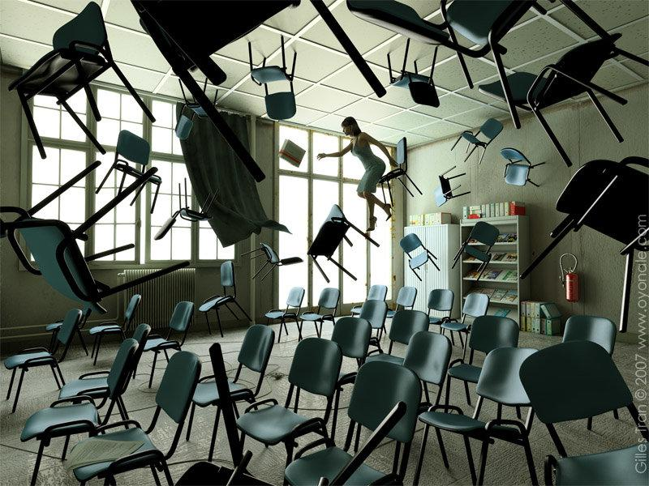

# Grafica vettoriale

# Grafica raster

# Codifica di immagini raster

-   Un'immagine è una matrice di colori, dove ogni colore è solitamente una tripletta RGB;
-   L'ordine con cui viene salvata la matrice (destra-sinistra, alto-basso, per righe o per colonne) è determinato dal formato;
-   Formati diversi implementano compressioni diverse;
-   Non sarà obbligatorio implementare la compressione delle immagini nei nostri codici, ma è comunque indispensabile conoscerne i fondamenti.

# Compressione dati

-   La compressione dei dati è un argomento molto importante in fisica computazionale.

-   Le simulazioni e gli esperimenti del XXI secolo richiedono di registrare quantità di dati sempre più grandi. Nell'ambito della cosmologia della CMB, bastano questi dati:

    -   Nel periodo 1989–1993, l'esperimento spaziale COBE/DMR ha registrato  meno di 8 GB di dati;
    -   Nel periodo 2001–2010, l'esperimento WMAP ha registrato 200 GB di dati;
    -   Nel periodo 2009–2013, l'esperimento Planck ha registrato 30 TB (30,000 GB) di dati.
    
    Grandi moli di dati sono comuni anche in altri domini della fisica (particelle, climatologia, etc.).

-   Apprendere i principi della compressione dati è estremamente utile!

# Compressione di immagini

-   Uno schermo di computer ha solitamente una risoluzione di 1920×1080 pixel.

-   Se vengono usati 8+8+8=24 bit per il colore sRGB di ogni pixel (3 byte per pixel), il numero totale di byte necessari è
    $$
    3 \times 1920 \times 1080 = 6\,220\,800
    $$
    che equivale a circa 6 MB.

-   Nelle immagini c'è solitamente molta informazione ridondante che può essere eliminata.

---

---

---

---

---

---

---

---

---

---

---

---

---

---

---

---

---

