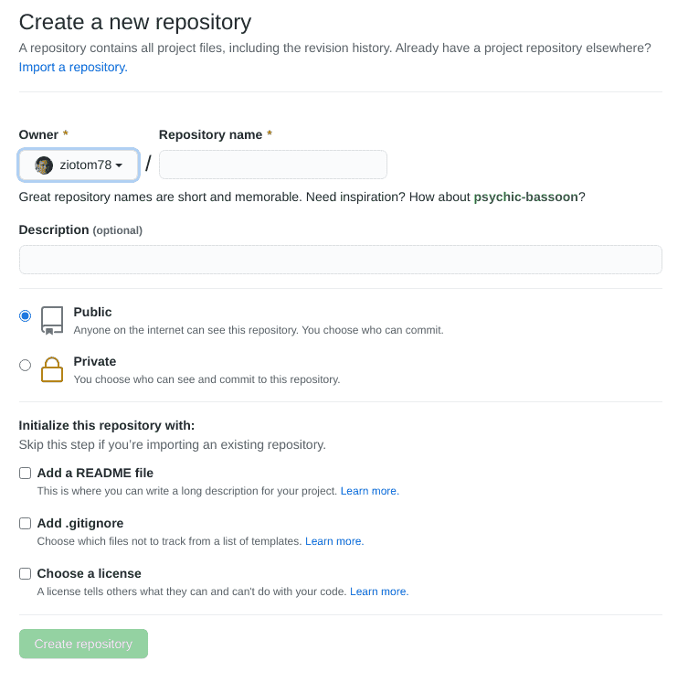
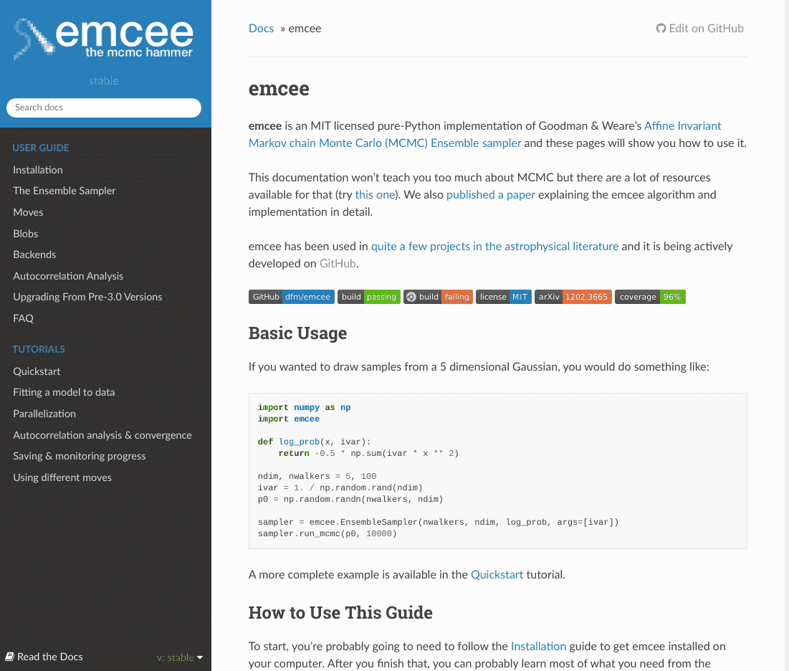
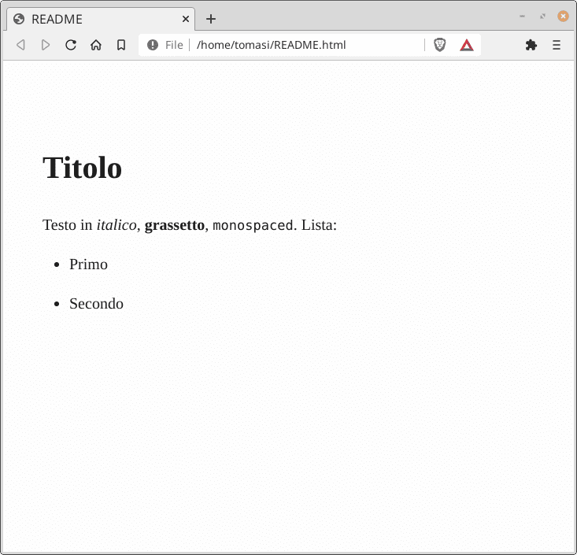
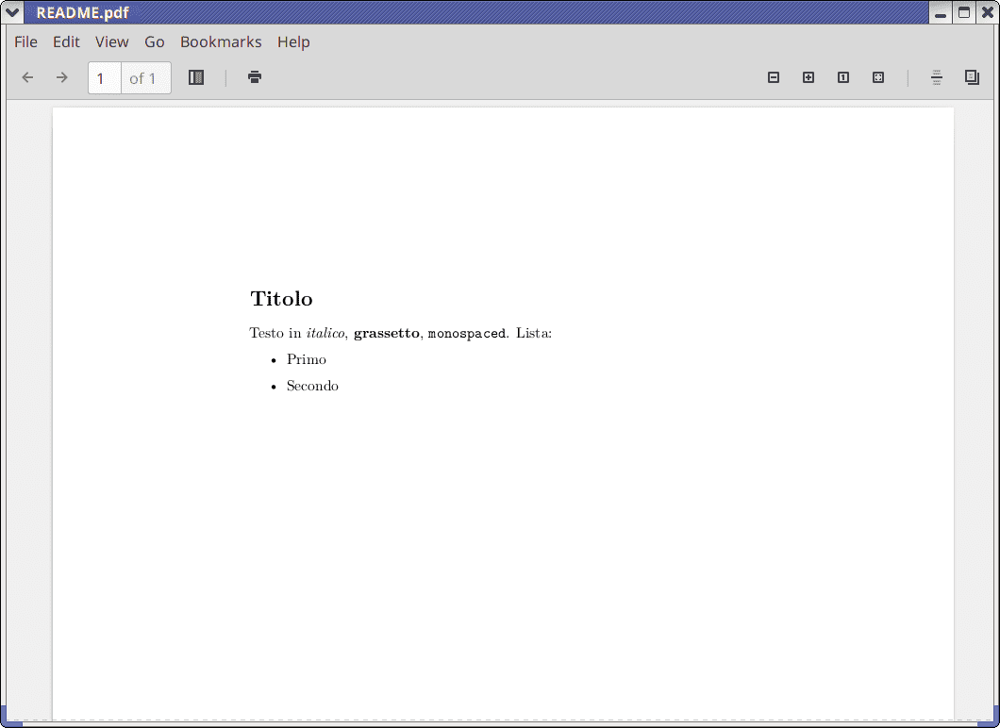
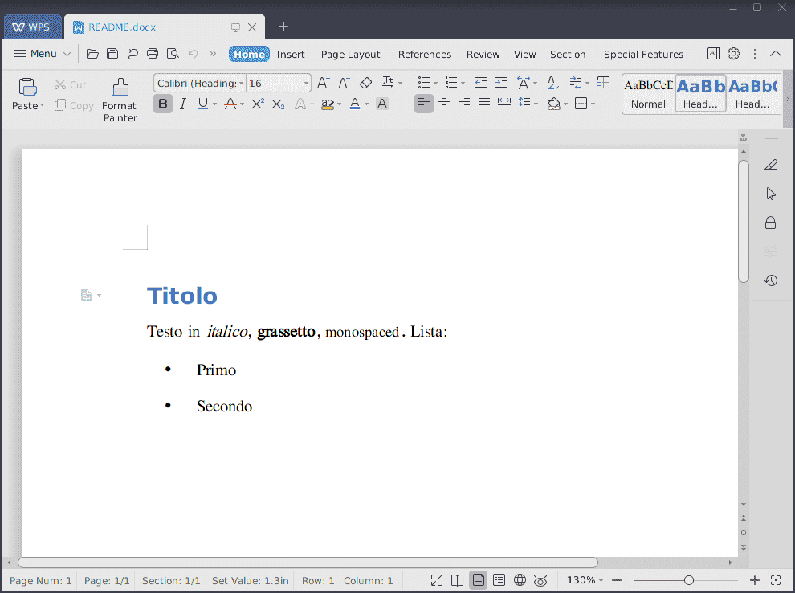

<center>
{height=620px}
</center>

# Ashton-Tate dBaseIII

<center>
{height=620px}
</center>

# Ashton-Tate dBaseIII

```text
                  IMPORTANT INFORMATION

Before using your dBASE III PLUS Disks, please note the 
following information before installing dBASE III PLUS:

For 256K dBASE III PLUS Operation:

dBASE III PLUS runs with DOS version 2.xx if you have 256K
installed memory in your computer.  If you have a mimimum 
of 384K of installed memory, dBASE III PLUS runs with DOS version
3.xx as well as version 2.xx. 

For 256K operation, we provide two files, CONFI256.SYS and
CONFI256.DB, on System Disk #1.  These two files set system
parameters for maximum overall performance of dBASE III PLUS in a
256K environment.  Save the original CONFIG.SYS and CONFIG.DB
files (also on System Disk #1) to another disk, and then use the
DOS COPY command to copy CONFI256.SYS and CONFI256.DB to
CONFIG.SYS and CONFIG.DB respectively.
```


# [Microsoft](https://www.youtube.com/watch?v=4Wd8K2n5ayk) [Word 5.5](http://download.microsoft.com/download/word97win/Wd55_be/97/WIN98/EN-US/Wd55_ben.exe) per DOS

```text
This file supplements the printed documentation for
Microsoft Word, version 5.5A.

--------Contents----------------------------------------
. Other Sources of Information
. Release Information for 5.5A
. Additional Setup Information
. Installing Word To Run Under Windows 3.0
. Using Word Under Windows 3.0 with a Hercules Adapter
. Installing Word To Run Under Windows 2.1
. New Mouse Driver
. Additional Style Sheet Information
. Additional Macro Information
. Using an IBM 8514 Monitor Under OS/2
. Using an IBM PS/2 Model 70 Display Under OS/2 1.21
. Using Word with KEYB.COM
. Switching between keyboard drivers
. Keyboard Information for non-US Keyboards
. Using Word with Presentation Manager
. Mouse Support and OS/2
. Installing Code Pages under OS/2
--------------------------------------------------------

OTHER SOURCES OF INFORMATION

For information on:         See:

Printers and printing       PRINTERS.DOC on Printer disk 1
Word-DCA conversions        WORD_DCA.DOC on Utilities disk 1
Word-RTF conversions        WORD_RTF.DOC on Utilities disk 1
Word 5.0 macro              MACROCNV.DOC on Program disk 1
  conversions
```

# I README oggi

-   Oggi un README è fondamentalmente diverso da com'era usato in passato
-   È diventato di importanza fondamentale:
    -   La quantità di FOSS (Free and Open Source Software) su Internet è impressionante;
    -   Gli utenti hanno bisogno di capire in poco tempo se un progetto fa al caso loro o no;
    -   Un README oggi combina la funzione di un annuncio pubblicitario (nel senso buono!) e di primo manuale d'uso.
-   È quindi indispensabile avere un `README` nei propri repository.
-   In effetti, quando create un nuovo repository in GitHub, vi viene proposto di generarne uno automaticamente!

---

<center>

</center>

# Scopo del README

-   È il primo documento in cui si imbatte un potenziale utente.
-   Deve comunicare in maniera concisa questi concetti:
    1.  A cosa serve il programma;
    2.  Cosa richiede per funzionare (Windows? Linux? una GPU? una
        stampante?);
    3.  Come si installa;
    4.  Esempi pratici che mostrino cos'è in grado di fare il
        programma (possibilmente più d'uno: partire da casi semplici e mostrare sinteticamente almeno un caso realistico);
    5.  Licenza d'uso.
-   Non deve addentrarsi troppo nei dettagli.

---

-   Cercate di essere *chiari* ma anche *sintetici*!
-   Esempio negativo ([`boost.array`](https://www.boost.org/doc/libs/1_74_0/doc/html/array.html)). L'introduzione inizia così:

    > The C++ Standard Template Library STL as part of the C++
    > Standard Library provides a framework for processing algorithms
    > on different kind of containers. However, ordinary arrays don't
    > provide the interface of STL containers (although, they provide
    > the iterator interface of STL containers).

    Un intero paragrafo, e ancora non si dice cosa faccia la libreria!
    (Non viene detto neppure nel paragrafo successivo…)

# Esempio: [emcee](https://emcee.readthedocs.io/en/stable/)

<center>
{height=620px}
</center>

# Readme-driven development

-   Idea di Tom Preston-Werner (creatore di GitHub e di [TOML](https://github.com/toml-lang/toml)) espressa in un [famoso articolo del 2010](https://tom.preston-werner.com/2010/08/23/readme-driven-development.html).
-   Prima di scrivere un programma, scrivete il README:
    -   Dà l'opportunità di pensare al progetto su grande scala, prima ancora di scrivere il codice (che obbliga a concentrarsi sui dettagli).
    -   Il momento in cui si inizia un progetto è quello in cui l'eccitazione e l'entusiasmo sono al massimo.
    -   Se si lavora in un team, la stesura del README aiuta già a comprendere come suddividere il lavoro, ed è più semplice discutere sulla base di idee scritte.
-   Non possiamo farlo nel nostro corso (purtroppo!), perché lo sviluppo del nostro codice segue un criterio pedagogico.

---

# Struttura di un README

-   Struttura consigliata dal sito [Make a README](https://www.makeareadme.com/):
    1.  Nome e descrizione;
    2.  Istruzioni di installazione;
    3.  Esempi d'uso;
    4.  Come contribuire al repository;
    5.  Licenza d'uso.
-   Il sito [Awesome README](https://github.com/matiassingers/awesome-readme) è una miniera di suggerimenti e di link a README di progetti veri da imitare (come [joe](https://github.com/karan/joe#readme): bellissimo!). Visitatelo, c'è da perdersi!

# Come scrivere un README?

# Sintassi dei README

-   In passato, i README erano semplici file di testo.
-   Abbiamo però visto che i README usati oggi includono grafica, codice evidenziato, titoli, etc.
-   Che facciamo, noi fisici dobbiamo scriverlo in LaTeX?!?

# Linguaggi di markup

-   Non bisogna essere così disperati per dover usare il LaTeX!
-   Negli anni sono nati una serie di linguaggi di markup con cui scrivere semplicemente del testo strutturato:
    -   [Markdown](https://en.wikipedia.org/wiki/Markdown) (estensione `.md`, es. `README.md`);
    -   [reStructuredText](https://en.wikipedia.org/wiki/ReStructuredText) (estensione `.rst`), molto usato nel mondo Python;
    -   [Asciidoc](https://en.wikipedia.org/wiki/AsciiDoc) (estensione `.adoc` oppure `.txt`);
    -   [Org-mode](https://en.wikipedia.org/wiki/Org-mode) (estensione `.org`);
    -   etc.
-   Il più usato in assoluto è senza dubbio Markdown.

# Markdown

-   Di solito i documenti a corredo di un programma vengono scritti in Markdown (è la scelta di default in GitHub).

-   Usando [pandoc](https://pandoc.org/), un file `.md` può essere
    convertito in:

    -   Pagine HTML (queste slide, fatte con [Reveal.js](https://revealjs.com/), ne sono un esempio!);
    -   LaTeX, incluso Beamer
        ([ctan.org/pkg/beamer](https://ctan.org/pkg/beamer));
    -   File Microsoft Word;
    -   Ebook in formato `.epub`;
    -   Etc.

-   Pandoc implementa una versione estesa di Markdown, e supporta equazioni come $\int x^2\,\mathrm{d}x$ e caratteri Unicode (UTF-8).

# Installazione di Pandoc

-   Pandoc (su sistemi Debian/Ubuntu/Mint):

    ```
    sudo apt install pandoc
    ```

-   TeX/LaTeX (idem):

    ```
    sudo apt install texlive-full
    ```

# Esempio di Markdown

-   Se avete installato Pandoc, create un file `README.md` con questo contenuto:

    ```markdown
    # Titolo

    Testo in *italico*, **grassetto**, `monospaced`. Lista:
    -   Primo
    -   Secondo
    ```

-   Convertitelo in un file HTML/Word/LaTeX con

    ```
    $ pandoc -t html5 --standalone -o README.html README.md
    $ pandoc -t docx  --standalone -o README.docx README.md
    $ pandoc -t latex --standalone -o README.tex  --pdf-engine=lualatex  README.md
    ```

---

<center>

</center>

---

<center>

</center>

---

<center>

</center>

# Alcuni trucchi (1/4)

-   Pandoc implementa una versione molto estesa di Markdown: consultate la [guida](https://pandoc.org/MANUAL.html#pandocs-markdown).

-   Usando `--standalone` viene generato un documento completo; è utile coi formati HTML o LaTeX.

-   Se si sceglie il formato LaTeX ma si specifica come output un file con estensione `.pdf`, il file viene compilato automaticamente usando pdfLaTeX (esempio visto prima).

# Alcuni trucchi (2/4)

```markdown
I ritorni a capo sono interpretati come in LaTeX:

Lorem ipsum dolor sit amet, consectetur adipiscing elit, sed do
eiusmod tempor incididunt ut labore et dolore magna aliqua. Ut enim ad
minim veniam, quis nostrud exercitation ullamco laboris nisi ut
aliquip ex ea commodo consequat.

Duis aute irure dolor in reprehenderit in voluptate velit esse
cillum dolore eu fugiat nulla pariatur. Excepteur sint occaecat
cupidatat non proident, sunt in culpa qui officia deserunt mollit
anim id est laborum.
```

# Alcuni trucchi (3/4)

```markdown
Si possono associare più paragrafi a una lista puntata:

-   Punto uno, con sottopunti:

    -   Primo
    -   Secondo
    
    Questo è un nuovo paragrafo del primo punto, seguito da codice C++:
    
    ```c++
    int main() {
        return 0;
    }
    ```
    
-   Punto secondo
```

# Alcuni trucchi (4/4)

```markdown
---
title: "Dei delitti e delle pene"
subtitle: "Nuova edizione corretta e accresciuta"
author: "Cesare Beccaria"
year: 1964
colorlinks: true
...

# A chi legge

Alcuni avanzi di leggi di un antico popolo conquistatore fatte
compilare da un principe che dodici secoli fa regnava in
Costantinopoli, frammischiate poscia co’ riti longobardi, ed involte
in farraginosi volumi di privati ed oscuri interpreti, formano quella
tradizione di opinioni che da una gran parte dell’Europa ha tuttavia
il nome di leggi; ed è cosa funesta quanto comune al dì d’oggi che una
opinione di Carpzovio, un uso antico accennato da Claro, un tormento
con iraconda compiacenza suggerito da Farinaccio sieno le leggi a cui
con sicurezza obbediscono coloro che tremando dovrebbono reggere le
vite e le fortune degli uomini. [Etc.]
```

# Personalizzazione

-   L'output di pandoc può essere personalizzato.

-   Per ogni formato di output è presente un *template*, che può essere ispezionato col comando `--print-default-template`:

    ```text
    $ pandoc --print-default-template=latex | head
% Options for packages loaded elsewhere
\PassOptionsToPackage{unicode$for(hyperrefoptions)$,$hyperrefoptions$$endfor$}{hyperref}
\PassOptionsToPackage{hyphens}{url}
$if(colorlinks)$
\PassOptionsToPackage{dvipsnames,svgnames*,x11names*}{xcolor}
$endif$
$if(dir)$
$if(latex-dir-rtl)$
\PassOptionsToPackage{RTLdocument}{bidi}
$endif$
    ```
    
-   Si può passare un template personalizzato con `--template=FILE`.

# Queste slide

-   Queste slide sono realizzate con pandoc, usando come formato di output `revealjs`. Il comando per produrle (semplificato) è il seguente:

    ```
    $ pandoc \
        --standalone \
        --katex \
        -V theme=white \
        -V progress=true
        -V slidenumber=true \
        -V width=1440 \
        -V height=810 \
        -f markdown+tex_math_single_backslash \
        -t revealjs \
        -o FILEOUTPUT.html \
        FILEINPUT.md
    ```
    
# Markdown in GitHub (1/2)

-   In GitHub non è necessario convertire il file `README.md`: il sito implementa un proprio sistema di conversione del Markdown.

-   Se si carica in un repository un file con nome `README.md`, GitHub
    lo mostrerà automaticamente convertito in una pagina HTML:

    <center>
    {height=320}
    </center>

# Markdown in GitHub (2/2)
    
-   GitHub interpreta il Markdown in modo lievemente diverso da Pandoc: consultate la guida [GitHub Flavored Markdown Spec](https://github.github.com/gfm/).
-   In particolare, non potete usare ritorni a capo all'interno di un paragrafo: nel testo seguente, la poesia viene riprodotta da GitHub con i versi separati ciascuno nella propria riga:

    ```markdown
    Voi, che sapete che cosa è amor,
    Donne vedete, s'io l'ho nel cor.
    Quello ch'io provo vi ridirò;
    è per me nuovo, capir nol so.
    ```
    
    (In pandoc sarebbe tutto scritto nel medesimo paragrafo).

# Licenze d'uso

# Licenze d'uso

-   Una «licenza d'uso» spiega agli utenti che scaricano un programma
    cosa gli sia lecito fare e cosa no.
-   È da sempre usata nel software commerciale.
-   È diventata sempre più importante anche in ambito accademico:
    -   Alcune istituzioni lo richiedono (non UniMI, che io sappia);
    -   Può mettere al riparo l'autore da sorprese spiacevoli.
-   Nei programmi FOSS è solitamente scritta in un file `LICENSE`,
    `LICENSE.txt` o `LICENSE.md` (in Markdown).
-   Un'ottima spiegazione è presente nell'articolo [*A Quick Guide to Software Licensing for the Scientist-Programmer*](https://journals.plos.org/ploscompbiol/article?id=10.1371/journal.pcbi.1002598) (Morin, Urban & Sliz, 2012).

# Importa a un fisico?

-   Nel mondo della ricerca si scrive moltissimo codice.

-   Lo scopo principale è di eseguire simulazioni e analisi, che vengono poi descritte in un articolo.

-   È importante che i risultati siano riproducibili: un lettore dovrebbe essere in grado di eseguire il medesimo programma usato dagli autori e ottenere gli stessi risultati.

-   Il programma dovrebbe essere quindi distribuito insieme al suo codice sorgente: in questo modo i lettori possono verificarne la correttezza.

-   Una licenza stabilisce quali sono i diritti del creatore del programma e quali i diritti dell'utente, ed è quindi **molto importante** anche per i fisici!

# Importa all'utente?

-   Supponiamo che voi stiate facendo un lavoro per cui vi serve un certo tipo di programma/libreria.

-   Avete trovato un programma/libreria su internet che sembra proprio fare al caso vostro.

-   Prima di usarlo, dovete però rispondere alle seguenti domande:

    -   Ho il permesso di scaricarlo?
    -   Ho il permesso di compilarlo?
    -   Ho il permesso di eseguirlo?
    -   Ho il permesso di pubblicare i risultati che ho ottenuto con questo programma?
    
# Il caso di GitHub

-   Quando vi siete registrati su GitHub, avete dovuto sottoscrivere i suoi [*Terms of service*](https://docs.github.com/en/github/site-policy/github-terms-of-service).

-   Quanti di voi li hanno letti? 👀

-   Sapete cosa potrebbe fare l'utente quadratico medio col codice che avete pubblicato su GitHub per questo corso?

# *GitHub's terms of service*

-   Anche se avete pubblicato codice su GitHub, voi restate i proprietari del codice.

-   Ma date ovviamente  a GitHub il diritto di mantenere sul loro server una copia del codice (in legalese si chiama «content», perché include anche altri tipi di file, come immagini e testo Markdown).

-   Date anche l'autorizzazione di GitHub a **visualizzare** il vostro *content*, e a permettere agli utenti di scaricarlo.

-   Ciò che **non** garantite necessariamente agli utenti è di poter compilare ed eseguire il vostro codice, e tantomeno di poter usare i risultati prodotti da esso in una pubblicazione!

# I vostri repository

-   Per come vi ho chiesto di creare i vostri repository, immagino che nessuno di voi abbia aggiunto un file `LICENSE` o `LICENSE.md`.

-   Si tratta di un file di testo che specifica quali sono i diritti
    dell'utente: se questo file non esiste nel repository, l'utente
    **non** è autorizzato a compilare il vostro codice, né ad
    eseguirlo, etc. Dovete dare il vostro consenso esplicito!

-   Se non siete esperti in questioni legali, è meglio che non scriviate da voi questo file.

-   Esistono molti tipi di licenze pronte per essere usate, e i file `LICENSE` sono solitamente prodotti tramite copia-e-incolla. Vediamo quindi quali licenze possono essere usate nel vostro lavoro.

# Tipi di licenze

Proprietary
: Sono usate per programmi come Microsoft Word, Apple Mac OS X, Adobe Photoshop, etc. Si trovano anche in ambito accademico.

Permissive
: Sono le licenze più usate in ambito accademico: sostanzialmente, dicono che col programma si può fare un po' di tutto.

Copyleft
: È una licenza molto usata nel mondo FOSS, e ci sono casi in cui è obbligatoria anche in ambito accademico.

# Le *Proprietary licenses*

-   Includono una lista di ciò che l'utente può fare; ciò che non è elencato, è implicitamente escluso.

-   Non sempre permettono all'utente di ottenere una copia del codice sorgente; quando ciò è previsto, è di solito solo per *lettura* e *verifica*.

-   È un tipo di licenza usata in ambito accademico, anche se non molto comune nell'ambito della fisica.

# Le *Permissive licenses*

-   È una famiglia di licenze che fornisce la massima libertà all'utente.

-   I tipi più famosi sono:
    -   [MIT](https://opensource.org/licenses/MIT) (usato da [Julia](https://github.com/JuliaLang/julia/blob/master/LICENSE.md) e da [dotnet](https://github.com/dotnet/roslyn/blob/main/License.txt));
    -   [BSD](https://opensource.org/licenses/BSD-3-Clause);
    -   [Apache License]() (usato da [Kotlin](https://github.com/JetBrains/kotlin/tree/master/license) e [clang](https://clang.llvm.org/));
    -   [Academic Free License](https://opensource.org/licenses/AFL-3.0).

-   L'utente può acquisire il codice sorgente, compilarlo, eseguirlo, etc.

-   In generale, in queste licenze si dice cosa è proibito, e ciò che non è elencato è implicitamente ammesso.

# Uso di *permissive licenses*

-   Non è proibito che l'utente modifichi il codice e lo redistribuisca a sua volta…

-   …e non viene vietato che l'utente incorpori il codice all'interno del *suo* programma, che venga poi rilasciato in una *proprietary license*.

-   L'unico requisito esplicito è che venga mantenuta l'attribuzione del codice: non posso prendere il codice di Tizio e pubblicarlo dicendo che è mio.


# *Copyleft licenses*

-   È un tipo di *Permissive license* che però pone vincoli importanti al modo in cui il codice viene redistribuito.

-   Se il codice di una *copyleft license* viene usato all'interno di un codice, anche quest'ultimo deve essere rilasciato con una *copyleft license*.

-   È detta *viral license*: se un programma «tocca» del codice *copyleft*, diventa automaticamente *copyleft* lui stesso.

-   L'esempio più famoso è la [GNU Public License](https://opensource.org/licenses/gpl-license), usata per Linux, Emacs, Bash e il vostro amato GCC.

# Che licenza usare?

-   Per il codice sviluppato in questo corso, in linea di principio potreste usare a vostro piacimento una *permissive* o *copyleft license*.

-   Ma se nelle prossime lezioni userete librerie esterne (verrà il momento), dovrete fare attenzione che la licenza della libreria sia compatibile:

    -   Se il vostro codice usa una *copyleft license*, dovete verificarne la compatibilità con quella della libreria;
    -   Se il vostro codice usa una *permissive license*, in generale non potete usare librerie con licenza *copyleft* a meno di non cambiare la vostra licenza.

-   Se non sapete cosa usare, la scelta più sicura è probabilmente la GPL.

# Come «usare» una licenza?

-   Il sito [Open Source Initiative](https://opensource.org/) riporta un template di varie licenze.

-   Per applicare una licenza al vostro codice, dovete compiere i seguenti passaggi:

    1.   Scegliete la licenza. Noi prendiamo come esempio la GPL versione 3, descritta sul sito [OSI](https://opensource.org/licenses/GPL-3.0).
    2.   Il sito OSI ha un [link](https://www.gnu.org/licenses/gpl-3.0.en.html) al testo della licenza sul sito GNU. Da questo sito si può scaricare la versione in [testo ASCII](https://www.gnu.org/licenses/gpl-3.0.txt) o in [Markdown](https://www.gnu.org/licenses/gpl-3.0.md).
    3.   Scaricate la licenza e salvatela in `LICENSE` (se testo ASCII) o `LICENSE.md` (se Markdown) dentro il vostro repository.
    4.   La maggior parte delle licenze consiglia di riportare un breve testo in un commento in cima a *ogni* file sorgente del vostro repository. (La GPL3 non fa eccezione).


# Gestione degli errori

# Errori

-   Nella scorsa esercitazione abbiamo implementato del codice per scrivere un file PFM.
-   Questa settimana implementeremo invece la *lettura* di un file PFM.
-   La lettura di un file è un'attività che è facilmente soggetta ad errori:
    -   Il file specificato dall'utente non esiste
    -   Il file è danneggiato
    -   Il file è in un formato valido ma che il nostro codice non è in grado di caricare (es., un file PFM è codificato *big endian*, ma noi abbiamo previsto solo *little endian*)

# Tipi di errore

-   Gli errori possono essere suddivisi in due classi:

    -   Errori di pertinenza del programmatore
    -   Errori di pertinenza dell'utente
    
-   A seconda del tipo di errore in cui vi imbattete, la sua gestione è diversa.

# Errori del programmatore

-   Si tratta di un errore logico del programma.
-   Un programma «perfetto» non dovrebbe mai avere errori logici.
-   Se si ha l'evidenza che è avvenuto un errore logico, sarebbe meglio segnalarlo **nel modo più rumoroso possibile**.

# Esempio

```python
my_list = [5, 3, 8, 4, 1, 9]
sorted = my_sort_function(my_list)

if not (len(my_list) == len(sorted)):
    print("Error, mismatch in the length of the sorted list")
    
if not (sorted[0] <= sorted[1]):
    print("Error, the array is not sorted")

# The program continues
...
```

# Esempio un po' migliorato

```python
my_list = [5, 3, 8, 4, 1, 9]
sorted = my_sort_function(my_list)

if (len(my_list) == len(sorted)) and (sorted[0] <= sorted[1]):
    # The program continues only if the conditions above are
    # valid
    ...
```

# Esempio migliorato

```python
my_list = [5, 3, 8, 4, 1, 9]
sorted = my_sort_function(my_list)

# If any "assert", the program will crash and will print details
# about what the code was doing. If PDB support is turned on,
# a debugger will be fired automatically.
assert len(my_list) == len(sorted)
assert sorted[0] <= sorted[1]

# The program continues
...
```

# Gestione errori del programmatore

-   Tutti i linguaggi implementano funzioni che consentono di mandare in crash un programma (es., `assert` e `abort` in C/C++).
-   Queste istruzioni solitamente stampano a video una serie di dettagli sulla causa dell'errore, e sono pensate per essere usate insieme a un debugger.
-   Eseguire un debugger è sensato: se l'errore è logico, è il programmatore che deve mettere mano al codice, non l'utente!
-   Attenzione al fatto che alcune di queste funzioni potrebbero non essere compilate in modalità *release*.

# Errori dell'utente

-   Sono errori a cui il programmatore non può far fronte:
    -   L'utente chiede di leggere un file che non esiste;
    -   L'utente chiede di scrivere un file su un supporto che non ha più spazio libero;
    -   L'utente specifica un input scorretto.
-   Vanno gestiti solitamente in modo molto diverso dagli errori del programmatore!

# Esempio

<asciinema-player src="./cast/user-error-74x25.cast" cols="74" rows="25" font-size="medium"></asciinema-player>

# Gestire errori dell'utente

-   Gli errori dell'utente sono **inevitabili**.
-   Se si ha evidenza che l'utente ha commesso un errore, ci sono diversi modi di reagire:
    1.  Stampare un messaggio di errore, il più chiaro possibile;
    2.  Chiedere all'utente di inserire di nuovo il dato scorretto;
    3.  In certi contesti il codice può decidere autonomamente come correggere l'errore.
    
        Ad esempio, se si chiede un valore numerico entro un certo intervallo $[a, b]$ e il valore fornito è $x > b$, si può porre $x = b$ e continuare.

# Correzione errori (1/2)

```python
x = float(input("Insert a number: "))
y = float(input("Insert another number: "))
if y != 0.0:
    print(f"The ratio {x} / {y} is {x / y}")
else:
    print("Error, the second number cannot be zero!")
```

# Correzione errori (2/2)

```python
x = float(input("Insert a number: "))

while True:
    y = float(input("Insert another number: "))
    if y == 0.0:
        print("Error, the second number cannot be zero!")
    else:
        break
        
print(f"The ratio {x} / {y} is {x / y}")
```

# Programma corretto

<asciinema-player src="./cast/user-error-corrected-74x25.cast" cols="74" rows="25" font-size="medium"></asciinema-player>

# Messaggi d'errore

-   Gli studenti hanno spesso la tendenza a stampare messaggi di errore.

-   Esempio (sbagliato) preso da un tema d'esame TNDS:

    ```c++
    double Bisezione::CercaZeri(double a, double b) {
        if(f->Eval(a) * f->Eval(b) >= 0) {
            cout << "Errore, teorema degli zeri non soddisfatto\n";
        } else {
            // Etc.
        }
    }
    ```

    Non c'è un `return` in corrispondenza dell'`if`, e l'esercizio chiedeva di calcolare lo zero di una funzione in un intervallo in cui lo zero **doveva esserci**. Se il teorema degli zeri non è soddisfatto, vuol dire che c'è un errore in `a` oppure `b`.

# Visibilità dei messaggi di errore

-   Se una funzione stampa un messaggio quando capita un errore, è molto probabile che quel messaggio si perda all'interno dell'output:

    ```text
    $ python3 my-beautiful-program.py
    Initializing the program...
    Now I am reading data from the device
    The device has sent 163421 samples
    Computing statistics on the samples
    Error, some samples are negative
    Sorting the samples
    Running a Monte Carlo simulations, please wait...
    Done, time elapsed: 164.96 seconds
    Producing the plots...
    Done, the results are saved in "output.pdf"
    $
    ```
    
-   Meglio rendere l'errore più visibile, ad esempio con i colori, oppure (meglio!) fermare del tutto l'esecuzione del programma appena l'errore si verifica.

# Errori dell'utente nelle funzioni

-   È solitamente molto semplice come gestire gli errori dell'utente nel `main` di un programma.
-   È invece meno chiaro come gestire gli errori nell'input passato a una funzione o un metodo, come ad esempio `Bisezione::CercaZeri`.
-   Nessuna funzione o metodo dovrebbe **mai** fare qualcosa di **catastrofico** (mandare in crash il programma) o **visibile** (stampare un messaggio d'errore a video) se l'errore può essere dovuto all'utente.
-   La **regola aurea** è che la funzione restituisca un valore di ritorno che segnali l'errore, oppure che sollevi un'eccezione.

# Restituire un errore

-   Se un linguaggio permette di restituire valori multipli, potete usare questa sintassi (molto usata in [Go](https://blog.golang.org/error-handling-and-go)):

    ```python
    (result, error_condition) = my_function(...)
    
    if error_condition:
        # Handle the error: print a message, crash the program, etc.
        ...
    ```
    
-   Potete impiegare le eccezioni, se il vostro linguaggio le supporta:

    ```python
    def my_function(...):
        if something_wrong:
            raise Exception("Error!")
    ```

# Parametri d'errore

In linguaggi come il C/C++, un approccio molto usato è quello di accettare un parametro addizionale che segnali l'errore:

```c++
double my_function(..., bool & error) {
    if (something_wrong) {
        error = true;
        return 0.0;
    }

    // ...

    error = false;
    return result;
}
```

Al posto di un `bool` potete usare una `enum class` per registrare il tipo di errore, o addirittura una `struct` per racchiudere informazioni complesse.

# Tipi *nullable*

Linguaggi come C\# e Kotlin definiscono il tipo *nullable*, che può essere usato con qualsiasi tipo, e ne indica l'*assenza*:

```csharp
// C# example

// Note the "?" after "double": this is the same syntax as in Kotlin
double? result = my_function(...);

if (! result.HasValue)
{
    // Something wrong happened, my_function didn't compute the result
}
```
