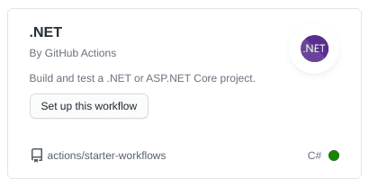

<iframe src="https://player.vimeo.com/video/520878087?badge=0&amp;autopause=0&amp;player_id=0&amp;app_id=58479" width="1280" height="720" frameborder="0" allow="autoplay; fullscreen; picture-in-picture" allowfullscreen title="Setting up GitHub Actions for CMake-based projects"></iframe>

# Esecuzione dei test

-   Provate a modificare uno dei test sul tipo `Vec3`, in modo che fallisca:

    -   Cambiate il file `test/vec3.cpp`
    -   Andate nella directory `build` ed eseguite `ctest`
    -   Fate il commit delle modifiche
    -   Inviate le modifiche a GitHub col comando `git push`

 -  Cosa succede al *CI build*? Fallisce come vi aspettavate?

# Suggerimenti

-   Se il build **non** fallisce, è probabilmente perché viene usato come tipo di build il `Release` anziché il `Debug`, e avete usato `assert` nel vostro codice
-   Soluzioni:
    -   Cambiate il file `.yml` in modo da usare `Debug` anziché `Release`
    -   Usate `#undef NDEBUG` prima di `#include <cassert>` (meglio!)
    -   Definite una vostra funzione `my_assert` (ancora meglio!)
    -   Usate una libreria di testing C++, come [Catch2](https://github.com/catchorg/Catch2/tree/v2.x) (ottimo!)
-   Insegnamento: provare **sempre** a far fallire uno o più test quando si configura un *CI build*!

# Indicazioni per C\#

# GitHub Actions

-   Aggiungete una Action al repository GitHub, una volta che avete fatto il commit ed eseguito `git push`.

-   Il modello è «.NET» (evitate il modello «.NET desktop», a noi serve quello per i programmi che funzionano da linea di comando):

    <center>
    
    </center>


# Indicazioni per Julia

# GitHub Actions

-   A differenza del C++ e del C\#, Julia non ha una action preconfigurata nel sito.
-   Ma GitHub gestisce un «marketplace», e il team Julia l'ha usato per fornire alla comunità una [serie di actions](https://github.com/julia-actions).
-   Le azioni che servono sono le seguenti:
    - `julia-actions/setup-julia@v1` (installa Julia);
    - `actions/cache@v1` (evita di reinstallare pacchetti Julia ogni volta)
    - `julia-actions/julia-buildpkg@latest` (compila il package)
    - `julia-actions/julia-runtest@latest` (esegue i test)


# File `UnitTests.yml`

```yaml
name: Unit tests

on:
  push:
    branches:
      - master

jobs:
  test:
    name: Julia ${{ matrix.julia-version }} - ${{ matrix.os }} - ${{ matrix.arch }}
    runs-on: ${{ matrix.os }}
    strategy:
      matrix:
        julia-version:
          - '1.5'
        os:
          - ubuntu-latest
        arch:
          - x64

    steps:
      - uses: actions/checkout@v2

      - name: "Set up Julia"
        uses: julia-actions/setup-julia@v1
        with:
          version: ${{ matrix.julia-version }}
          arch: ${{ matrix.arch }}

      - name: "Cache artifacts"
        uses: actions/cache@v1
        env:
          cache-name: cache-artifacts
        with:
          path: ~/.julia/artifacts
          key: ${{ runner.os }}-test-${{ env.cache-name }}-${{ hashFiles('**/Project.toml') }}
          restore-keys: |
            ${{ runner.os }}-test-${{ env.cache-name }}-
            ${{ runner.os }}-test-
            ${{ runner.os }}-

      - name: "Build package"
        uses: julia-actions/julia-buildpkg@latest

      - name: "Run unit tests"
        uses: julia-actions/julia-runtest@latest
```

# Indicazioni per Kotlin


# GitHub Actions

-   Selezionate «Java with Gradle»:

    <center>
    
    </center>
    
    Gradle scaricherà automaticamente il supporto Kotlin.

-   Il processo proverà a compilare il codice e a eseguire *tutti* i test nel repository

# Risoluzione dei problemi

-   Ricordatevi di aggiungere al commit i file in `gradle/wrapper/`

-   Se avete problemi a causa della versione di Gradle, rigenerate `gradlew` da linea di comando così:

    ```sh
    gradle wrapper --gradle-version 5.3
    ```
    
    (Gradle supporta Kotlin a partire dalla versione 5.3).
