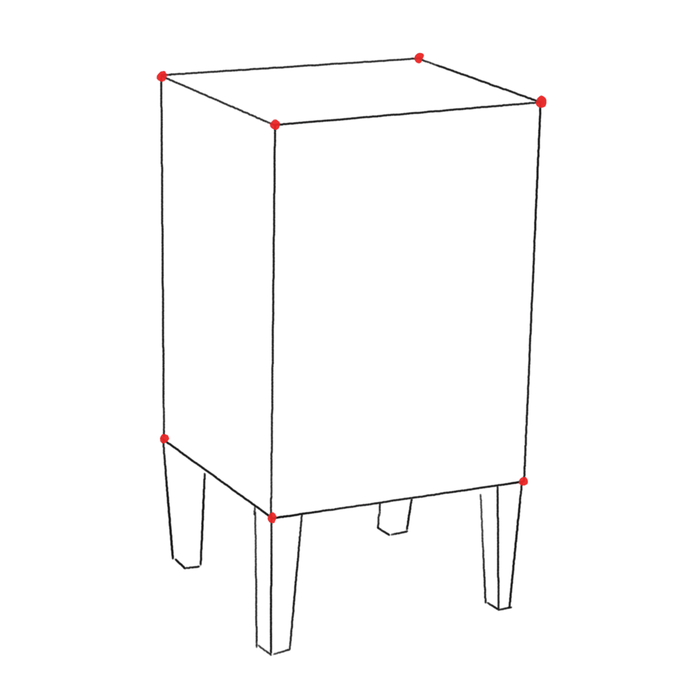
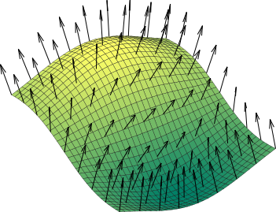
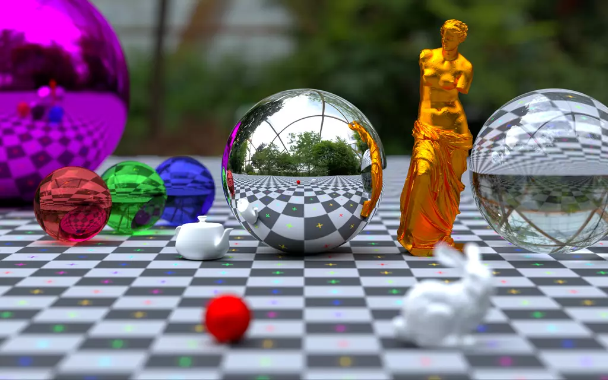

<center>
{height=620}
</center>

---

<center>
{height=620}
</center>

---

<center>
{height=620}
</center>

---

<center>
{height=620}
</center>

# Il problema geometrico

-   Collocazione degli oggetti nello spazio?
-   Dove sta l'osservatore, e verso cosa sta guardando?
-   Superficie degli oggetti?

# Posizioni e trasformazioni

-   La descrizione geometrica di un oggetto nello spazio fa solitamente uso di trasformazioni.

-   Queste trasformazioni sono necessarie per collocare gli oggetti che compongono la scena in modo che la loro posizione, il loro orientamento e le loro dimensioni siano quelle desiderate.

-   Anche la posizione della telecamera viene specificata tramite trasformazioni che ne identificano la posizione (dove sta l'osservatore?) e l'orientamento (in che direzione sta guardando?).

# Interazione con superfici

<center>

</center>

Il modo in cui un raggio di luce interagisce con una superficie dipende dalla BRDF, che [è espressa in termini dell'angolo](tomasi-ray-tracing-01a-rendering-equation.html#/la-brdf) $\theta = N_x \cdot \Psi$ tra la direzione di incidenza $\Psi$ e la normale $N_x$ alla superficie nel punto $x$.

# Codifica della geometria

Per risolvere l'equazione del rendering numericamente, il nostro codice deve trattare correttamente una serie di quantità:

-   **Punti** nello spazio tridimensionale (posizioni dei vertici del comodino);
-   **Vettori** 3D (direzioni di propagazione della luce);
-   **Normali** (rappresentano l'inclinazione della superficie in un punto);
-   **Matrici** (codificano le trasformazioni).

Ripassiamo quindi le proprietà di questi oggetti geometrici.

# Ripasso di algebra lineare

# Spazi vettoriali

Uno spazio vettoriale $V$ su un campo $F$ è un insieme non vuoto $V$ di elementi, detti *vettori*, associato a due operatori $+: V \times V \rightarrow V$ e $\cdot: F \times V \rightarrow V$ che soddisfano queste proprietà $\forall u, v, w \in V, \forall \alpha, \beta \in F$:

#.  $+$ è commutativo e associativo;
#.  Esiste un vettore $0$ che è elemento neutro per $+$;
#.  $\forall u \in V,\ \exist -u \in V: u + (-u) = 0$;
#.  $\alpha(\beta v) = (\alpha\beta) v,\quad (\alpha + \beta) v = \alpha v + \beta v,\quad \alpha(v + u) = \alpha v + \alpha u$;
#.  Se $1 \in F$ è l'elemento neutro del prodotto su $F$, allora $1u = u$.

# Prodotto interno

Dato uno spazio vettoriale $V$ su $F$, il prodotto interno è un'operazione $\left<\cdot, \cdot\right>: V \times V \rightarrow F$ che gode delle seguenti proprietà $\forall u, v, w \in V, \forall \alpha \in F$:

#.  $\left<\alpha u, v\right> = \alpha \left<u, v\right>$;
#.  $\left<u + v, w\right> = \left<u, w\right> + \left<v, w\right>$;
#.  $\left<u, v\right> = \overline{\left<v, u\right>}$;
#.  $\left<u, u\right> > 0$ se $u \not= 0$.

Un esempio è il classico prodotto scalare $\vec u \cdot \vec v = \left\|\vec u\right\|\,\left\|v\right\|\,\cos\theta$ su $\mathbb{R}^n$.

# Norma e ortogonalità

-   Dato un prodotto interno, si può definire la *norma* $\left\|\cdot\right\|: V \rightarrow F$ in questo modo:

    $$
    \left\|u\right\| = \sqrt{\left<u, u\right>},
    $$
    
    che è positiva definita, e si annulla solo se $u = 0$.
    
-   Si definiscono *ortogonali* due vettori $u$ e $v$ se vale che $\left<u, v\right> = 0$.

-   Un vettore $u$ tale che $\left\|u\right\| = 1$ si dice *normalizzato*.

# Generatori

-   Lo spazio generato da un insieme di vettori $\{v_i\}_{i=1}^N$ è l'insieme

    $$
    \mathrm{Span}\left(\{v_i\}_{i=1}^N\right) = \left\{\sum_{i=1}^N \alpha_i v_i \forall \alpha_i \in F\right\}.
    $$

-   Nel caso di $\mathbb{R}^3$:
    #.  Lo spazio generato da $\vec v$ è la retta passante per 0 e allineata con $\vec v$.
    #.  Lo spazio generato da due vettori $\vec v$ e $\vec w$ non paralleli è il piano passante per l'origine su cui giacciono $\vec v$ e $\vec w$. (V. slide seguente).

# Esempio: piano generato

```{.asy im_fmt="html" im_opt="-f html" im_out="img,stdout,stderr" im_fname="vector_generators"}
size(0,100);
import three;
currentlight=Viewport;

draw(O--2X, gray); //x-axis
draw(O--2Y, gray); //y-axis
draw(O--2Z, gray); //z-axis

real[][] rot = rotate(15, X) * rotate(30, Y);
path3 pl = ((2, -2, 0) -- (-2, -2, 0) -- (-2, 2, 0) -- (2, 2, 0) -- cycle);
draw(surface(rot * pl), green + opacity(0.2));
draw(rot * pl, black);
draw(rot * ((0, 0, 0) -- X), blue, Arrow3);
draw(rot * ((0, 0, 0) -- (0.3 * (X + 2Y))), red, Arrow3);
```


# Basi (1/2)

-   I vettori $\{v_i\}_{i=1}^N$ si dicono *linearmente indipendenti* se l'uguaglianza

    $$
    \sum_{i=1}^N \alpha_i v_i = 0
    $$
    
    vale solo se $\alpha_i = 0\ \forall i=1\ldots N$.

-   Un insieme di vettori $\left\{v_i\right\}_{i=1}^N$ è detto *base* di $B$ se sono linearmente indipendenti e generano $V$, ossia

    $$
    \mathrm{Span}\left(\{v_i\}_{i=1}^N\right) = V.
    $$
    
# Basi (2/2)

-   Se $V$ ammette due basi $\left\{e_i\right\}_{i=1}^N$ ed $\left\{f_i\right\}_{i=1}^M$, il numero di elementi in entrambe è identico ($N = M$) ed è detto *dimensione* di $V$. (Ignoriamo in questo corso gli spazi infinito-dimensionali.)

-   Si definisce *base ortonormale* di uno spazio vettoriale $V$ dotato di prodotto interno l'insieme di vettori $\left\{e_i\right\}_{i=1}^N$ tali che

    $$
    \left<e_i, e_j\right> = \delta_{ij}\quad\forall i, j = 1 \ldots N.
    $$
    
# Rappresentazione di vettori

-   Data una base $\{e_i\}_{i=1}^N$, è sempre possibile scrivere $v \in V$ come

    $$
    v = \sum_{i=1}^N \alpha_i e_i,
    $$
    
    dove $\alpha_i \in F$. (Conseguenza del fatto che la base genera lo spazio $V$).
    
-   Tale rappresentazione è sempre unica; se la base è ortonormale, allora

    $$\alpha_i = \left<v, e_i\right>.$$
    
-   I vettori si rappresentano come matrici a una colonna: $v = (\alpha_1\ \alpha_2\ \ldots)^t$.

# Rappresentazione di vettori

-   Il fatto che $\alpha_i = \left<v, e_i\right>$ vale **solo** se la base è ortonormale!

-   Ad esempio, consideriamo sul piano $\mathbb{R}^2$ la base $e_1 = (1, 0), e_2 = (1, 1)$. Il vettore $v = (4, 3)$ si scompone risolvendo un sistema lineare, e la soluzione è

    $$
    v = e_1 + 3 e_2 = \begin{pmatrix}1\\0\end{pmatrix} + 3 \begin{pmatrix}1\\1\end{pmatrix} = \begin{pmatrix}4\\3\end{pmatrix},
    $$
    
    ma $\left<v, e_1\right> = 4$ e $\left<v, e_2\right> = 7$.

-   Il nostro codice userà sempre basi ortonormali.

# Trasformazioni lineari

-   Una trasformazione lineare da uno spazio vettoriale $V$ a uno spazio $W$ è una funzione lineare $f: V \rightarrow W$:

    $$
    f(\alpha u + \beta v) = \alpha f(u) + \beta f(v).
    $$
    
-   Dalla linearità ne segue che $f(0) = 0$, perché

    $$
    f(0) = f(v - v) = f(v) - f(v) = 0\quad\forall v \in V.
    $$

# Matrici (1/2)

-   Una matrice $M$ è un insieme di valori scalari $\left\{m_{ij}\right\} \in F$ che rappresenta una trasformazione lineare $f: V \rightarrow W$ secondo una coppia di basi per $V$ e per $W$.

-   La matrice $M$ che rappresenta $f: V \rightarrow W$ deve avere $n = N$ colonne e $m = M$ righe, dove $N$ è la dimensione di $V$ e $M$ è la dimensione di $W$.

# Matrici (2/2)

-   Se si conosce il valore di $f(e_i)\ \forall e_i$, si può calcolare $f$ su qualsiasi vettore:

    $$
    f(v) = f\left(\sum_{i=1}^N \alpha_i e_i\right) =
    \sum_{i=1}^N \alpha_i f(e_i).
    $$

-   Il punto precedente si lega al fatto che la colonna $i$-esima della matrice $M$ contiene la rappresentazione di $f(e_i)$, con $e_i$ elemento $i$-esimo della c.d. **base canonica** di $V$: $e_1 = (1\ 0\ 0\ldots)^t, e_2 = (0\ 1\ 0\ldots)^t$, etc.

# Primo esempio

-   Consideriamo la matrice in $\mathbb{R}^2$

    $$
    M = \begin{pmatrix}3&4\\2&-1\end{pmatrix}
    $$
    
    e la base canonica $e_1 = (1\ 0)^t, e_2 = (0\ 1)^t$.
    
-   È facile vedere che la prima colonna di $M$ è uguale a $M e_1$ e la seconda a $M e_2$:

    $$
    M e_1 = \begin{pmatrix}3&4\\2&-1\end{pmatrix} \begin{pmatrix}1\\0\end{pmatrix} = \begin{pmatrix}3\\2\end{pmatrix},\quad
    M e_2 = \begin{pmatrix}3&4\\2&-1\end{pmatrix} \begin{pmatrix}0\\1\end{pmatrix} = \begin{pmatrix}4\\-1\end{pmatrix}.
    $$

# Secondo esempio

-   Scriviamo la matrice $R(\theta)$ che rappresenta una rotazione di $\theta$ intorno all'origine del piano cartesiano $xy$.

-   Per quanto detto, è sufficiente calcolare $R(\theta) e_1$ e $R(\theta) e_2$:

    $$
    R(\theta) e_1 = \begin{pmatrix}\cos\theta\\\sin\theta\end{pmatrix}, \quad
    R(\theta) e_2 = \begin{pmatrix}\cos(\theta + 90^\circ)\\\sin(\theta + 90^\circ)\end{pmatrix} = \begin{pmatrix}-\sin\theta\\\cos\theta\end{pmatrix},
    $$
    
    perché essi sono le colonne della matrice $R(\theta)$:
    
    $$
    R(\theta) = \begin{pmatrix}\cos\theta&-\sin\theta\\\sin\theta&\cos\theta\end{pmatrix}.
    $$

# Riflessioni

-   Consideriamo ora un tipo particolare di trasformazione, detta *riflessione*.

-   Punti, vettori ed angoli si trasformano in maniera intuitiva rispetto alle riflessioni:

    <center>
    {height=380px}
    </center>

# Pseudovettori

-   Consideriamo ora un'automobile che si allontana da noi, e la sua copia riflessa.

-   Il momento angolare delle ruote $\vec\omega$ **non** si trasforma come un normale vettore nella riflessione: è uno *pseudovettore*.

    <center>
    {height=380px}
    </center>
    
# Pseudovettori

-   Il problema di $\vec\omega$ è che è definito tramite il prodotto vettoriale: $\vec \omega = \vec r \times \vec p$, e il risultato di un prodotto vettoriale è *sempre* uno pseudovettore.

-   Questo si vede anche nel caso della legge di Ampère:

    <center>
    {height=380px}
    </center>


# Trasformazioni

---

<center>

</center>

# Tipi di trasformazioni

-   Con l'eccezione delle trasformazioni 3D→2D, implementeremo t. **invertibili**.

-   Le trasformazioni che implementeremo saranno le seguenti:
    #.  Trasformazione di scala (ingrandimento/rimpicciolimento);
    #.  Rotazione attorno ad un asse;
    #.  Traslazione (spostamento).
    
    <center>
    
    </center>

# Trasformazioni di scala

# Proprietà generali

-   Una trasformazione di scala è rappresentata da una matrice diagonale $M = \mathrm{diag}(s_1, s_2, \ldots)$ con $s_i \not= 0\ \forall i$:

    $$
    M = \begin{pmatrix}s_1& 0& \vdots\\0& s_2& \vdots\\\ldots& \ldots&\end{pmatrix}.
    $$
    
-   Trasformazioni di scala in cui $s_i < 0$ sono anche dette *speculari* rispetto all'asse $i$-esimo (riflessione rispetto a uno specchio).

# Esempio

-   Un cerchio sul piano può essere trasformato in un ellisse tramite una trasformazione di scala; nell'esempio qui sotto, $M = \mathrm{diag}(1/2, 1)$:

    <center>
    ```{.gle im_fmt="svg" im_opt="-cairo -device svg" im_out="img" im_fname="scale-demo"}
    size 10 4

    amove 2 2
    circle 2 fill grey50

    amove 7.5 2
    begin scale 0.5 1.0
        circle 2 fill grey20
    end scale
    ```
    </center>
    
-   Una riflessione rispetto all'asse $y$ è rappresentata da $M = \mathrm{diag}(1, -1)$.

    <center>
    ```{.gle im_fmt="svg" im_opt="-cairo -device svg" im_out="img" im_fname="reflect-demo"}
    size 10 4

    begin path fill grey50 stroke
        amove 7 0
        rline 3 0
        rline 0 4
        closepath
    end path

    begin path fill grey20 stroke
        amove 3 0
        rline -3 0
        rline 0 4
        closepath
    end path
    ```
    </center>

# Trasformazioni e normali

-   Già con questo tipo di trasformazioni abbiamo un problema!

-   Le normali agli oggetti non si trasformano come dovrebbero:

    <center>
    
    </center>

-   Qual è la legge di trasformazione per le normali?

# Trasformazioni e normali

-   Una normale $\hat n$ è definita in termini del vettore tangente $\hat v$:

    $$
    \hat n^t \hat v = 0.
    $$
    
-   Supponiamo di voler applicare la trasformazione $N$ (invertibile) al vettore $\hat v$. Al vettore $\hat n$ dovremo applicare una trasformazione $M$ tale che

    $$
    \left(M \hat n\right)^t \left(N \hat v\right) = 0.
    $$
    
# Trasformazioni e normali

-   Sapendo che $\left(A B\right)^t = B^t A^t$, si ottiene che
    
    $$
    \left(M \hat n\right)^t \left(N \hat v\right) = 0\quad\Rightarrow\quad\hat n^t \left(M^t N\right) \hat v = 0.
    $$
    
-   Sapendo già che $\hat n^t \hat v = 0$, ne segue che l'equazione è vera se

    $$
    M^t N = \mathbb{1}\quad\Rightarrow\quad M = \left(N^{-1}\right)^t,
    $$
    
    dove abbiamo usato l'assunzione che la trasformazione $N$ ammette un'inversa.

# Trattamento delle normali

-   Abbiamo visto che le normali si comportano in maniera diversa dai vettori nel caso specifico delle trasformazioni di scala.

-   Il risultato che abbiamo ottenuto è però *generale*: non vale solo per trasformazioni di scala, ma per qualsiasi trasformazione invertibile $N$.

-   In codici numerici è conveniente memorizzare in un tipo (`struct`, `class`, `record`, etc.) che rappresenta una trasformazione invertibile sia la matrice $N$ corrispondente a una trasformazione che la trasposta della sua inversa $\left(N^{-1}\right)^t$: si impiega più memoria, ma i calcoli sono più rapidi.

# Rotazioni

---

# Formalismo

-   Per definire una rotazione sul piano attorno all'origine è sufficiente **un** grado di libertà.

-   Però per definire una rotazione in tre dimensioni intorno all'origine sono necessari **tre** gradi di libertà: l'asse di rotazione e l'angolo. (L'asse di rotazione è un vettore di lunghezza unitaria, quindi ha solo due gradi di libertà).

-   Ci sono vari modi per rappresentare una rotazione, alcuni più efficaci di altri a seconda del contesto: angoli di Eulero, angolo/asse, matrici di rotazione, quaternioni. Noi ci concentreremo sulle matrici di rotazione.


# Rotazioni e matrici

-   In 2D, abbiamo già scritto la [matrice di rotazione attorno all'origine](./tomasi-ray-tracing-06a-geometry.html#/secondo-esempio):

    $$
    R(\theta) v = \begin{pmatrix}\cos\theta&-\sin\theta\\\sin\theta&\cos\theta\end{pmatrix} \begin{pmatrix}v_1\\v_2\end{pmatrix} = 
    \begin{pmatrix}v_1\cos\theta - v_2\sin\theta\\v_1\sin\theta + v_2\cos\theta\end{pmatrix}.
    $$

    <center>
    ```{.gle im_fmt="svg" im_opt="-cairo -device svg" im_out="img" im_fname="rotation-demo"}
    size 6 4
    set hei 0.6
    set lwidth 0.04

    amove 0 1
    rline 6 0 arrow end

    amove 3 0
    rline 0 4 arrow end

    amove 3 1
    begin rotate 30
        rline 2 0
        ellipse 0.1 0.1 fill black
    end rotate
    
    amove 3 1
    begin rotate 50
        rline 2 1
        ellipse 0.1 0.1 fill gray50
    end rotate

    arc 1 30 80
    
    amove 3.75 2
    text θ
    
    amove 5 2
    text v
    
    amove 3.9 3.2
    text r(θ)v
    ```
    </center>

-   In 2 dimensioni, vale che $R(\alpha) R(\beta) = R(\beta) R(\alpha) = R(\alpha + \beta)$.
    
# Rotazioni in 3D
    
-   In 3 dimensioni, le rotazioni possono essere notevolmente più complesse, perché ci sono infiniti assi usabili per la rotazione intorno all'origine!
    
    <center>
        <video src="./media/rotating-cubes.mp4" width="960" height="360" controls loop autoplay/>
    </center>

-   In generale, una matrice $R$ in $\mathbb{R^n}$ rappresenta una rotazione se e solo se $\det R = 1$ e $R R^t = \mathbb{1}$, ossia se la trasposta coincide con l'inversa.

# Composizione di rotazioni

-   In 3D, la composizione di rotazioni **non commuta** (a differenza del caso 2D).

-   I due dadi qui sotto subiscono due rotazioni $R_1$ ed $R_2$: per il rosso la rotazione è $R_1 R_2$, per il verde è $R_2 R_1$. Si vede che le posizioni finali sono diverse:

    <center>
        <video src="./media/rotation-commutativity.mp4" width="640" height="360" controls/>
    </center>

# Rotazioni elementari

-   È facile scrivere le rotazioni attorno ai tre assi $\hat e_x$, $\hat e_y$ ed $\hat e_z$. Ad esempio, la rotazione attorno a $\hat e_z$ è

    $$
    R_z(\theta) v = \begin{pmatrix}\cos\theta&-\sin\theta&0\\\sin\theta&\cos\theta&0\\0&0&1\end{pmatrix}.
    $$
    
-   È possibile scrivere una matrice $R_{\hat v}(\theta)$ che descriva una rotazione di un angolo θ attorno a un asse $\hat v$ arbitrario; vedi la [pagina Wikipedia](https://en.wikipedia.org/wiki/Rotation_matrix#Basic_rotations) per i dettagli.

# Angoli di Eulero

-   Una rotazione generica $R_{\hat v}(\theta)$ è sempre esprimibile come prodotto delle rotazioni elementari $R_x(\theta_x)$, $R_y(\theta_y)$ e $R_z(\theta_z)$ per adeguati valori di $\theta_x, \theta_y, \theta_z$.

-   Questa proprietà è alla base del formalismo delle rotazioni con gli [angoli di Eulero](https://en.wikipedia.org/wiki/Euler_angles), che però noi non useremo nel nostro codice.

# Traslazioni

# Il problema delle traslazioni

-   Una traslazione $T_{\vec{k}}$ è una operazione che sposta un punto $P$ di $\vec{k}$:

    $$
    T_{\vec{k}} (P) = P + \vec{k}.
    $$

-   Finora abbiamo utilizzato matrici per rappresentare trasformazioni di scala e rotazioni. Purtroppo le matrici 3×3 **non possono** rappresentare traslazioni nello spazio tridimensionale: una traslazione $T$ non è un operatore lineare! Se lo fosse, allora varrebbe che

    $$
    T_{\vec{k}}(0) = 0\quad\forall\ \vec{k}.
    $$

# Coordinate omogenee

-   Fortunatamente è possibile un trucco, molto usato nella *computer graphics*, che consiste nell'usare **coordinate omogenee**.

-   Nelle coordinate omogenee si considera lo spazio $\mathbb{R}^4$ anziché $\mathbb{R}^3$, e si scrivono i punti $P$ e i vettori $\vec{v}$ in modo diverso:

    $$
    P = \begin{pmatrix}p_x\\p_y\\p_z\\1\end{pmatrix}, \quad
    \vec{v} = \begin{pmatrix}v_x\\v_y\\v_z\\0\end{pmatrix}.
    $$

# Trasformazioni omogenee

-   Una matrice $M$ si trasforma in coordinate omogenee aggiungendo una riga e una colonna:

    $$
    M =
    \begin{pmatrix}
    m_{11}&m_{12}&m_{13}\\
    m_{21}&m_{22}&m_{23}\\
    m_{31}&m_{32}&m_{33}
    \end{pmatrix}\ \rightarrow%
    \ M_h =
    \begin{pmatrix}
    m_{11}&m_{12}&m_{13}&0\\
    m_{21}&m_{22}&m_{23}&0\\
    m_{31}&m_{32}&m_{33}&0\\
    0&0&0&1
    \end{pmatrix}
    $$

-   Dalla forma a blocchi di $M_h$ è immediato capire che l'applicazione di $M_h$ a $P$ e a $\vec{v}$ porta allo stesso risultato del caso non-omogeneo in ℝ³.

# Traslazioni

-   Nelle coordinate omogenee, l'operazione di traslazione lungo un vettore $\vec{k}$ è lineare, e si rappresenta così:

    $$
    T_{\vec{k}} =
    \begin{pmatrix}
    1&0&0&k_x\\
    0&1&0&k_y\\
    0&0&1&k_z\\
    0&0&0&1
    \end{pmatrix}
    $$

-   L'operatore è ovviamente lineare, perché è in forma matriciale.

# Proprietà

-   $T_{\vec{k}}^{-1} = T_{-\vec{k}}$: la trasformazione inversa della traslazione lungo $\vec{k}$ è la traslazione lungo $-\vec{k}$;
-   $T_{\vec{u}} T_{\vec{w}} = T_{\vec{u} + \vec{w}}$: la composizione di due traslazioni è uguale alla traslazione lungo la somma dei due vettori;
-   $T_{\vec{u}} T_{\vec{w}} = T_{\vec{w}} T_{\vec{u}}$: le traslazioni sono operatori commutativi;
-   $T_{\vec{k}} \vec{v} = \vec{v}$: a differenza dei punti, i vettori non vengono traslati.

# Rototraslazioni

-   Comporre una traslazione $T_{\vec{k}}$ e una rotazione $R(\theta)$ dipende dall'ordine: il risultato di $T_{\vec{k}}\,R(\theta)$ è diverso da quello di $R(\theta)\,T_{\vec{k}}$:

    <center>
        <video width="640" height="360" src="./media/rototranslation.mp4" controls/>
    </center>

-   Si può verificare che le matrici omogenee implementano correttamente questo comportamento.
