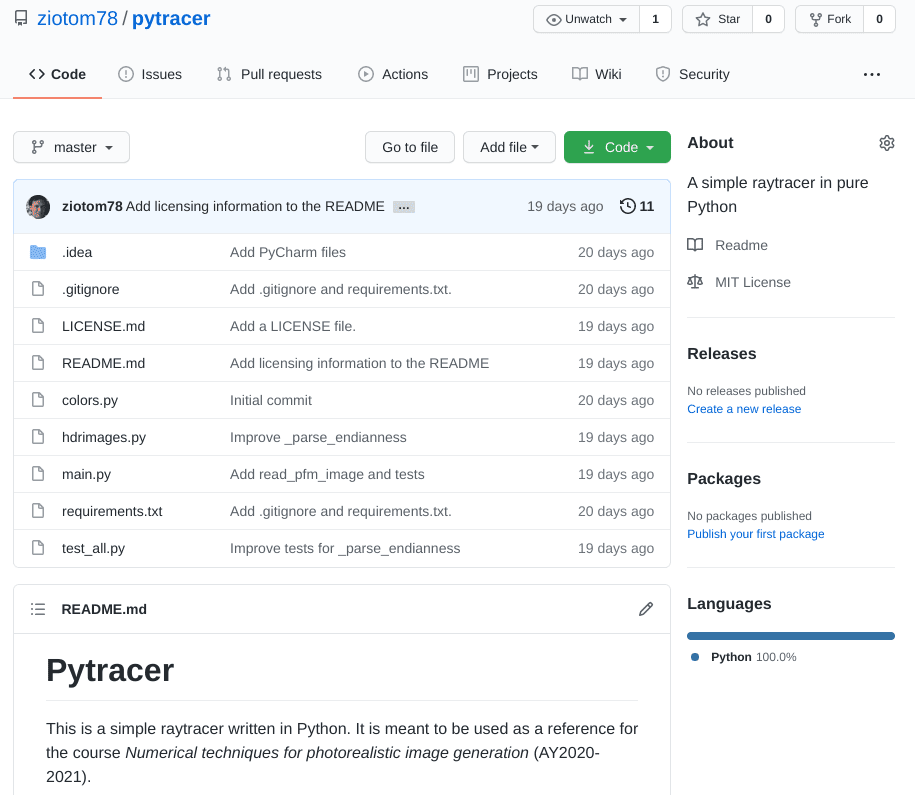
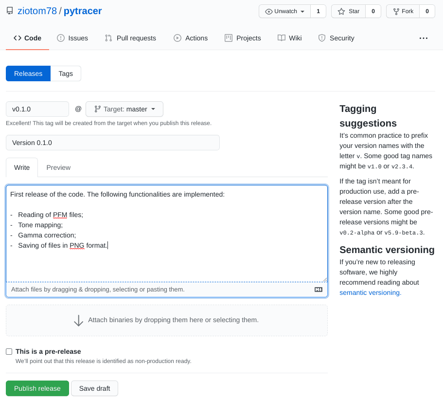
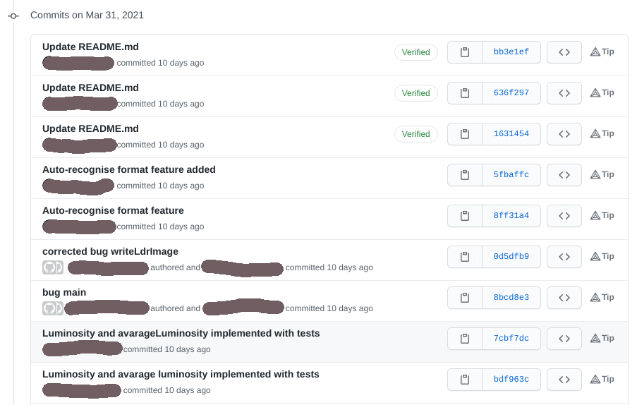
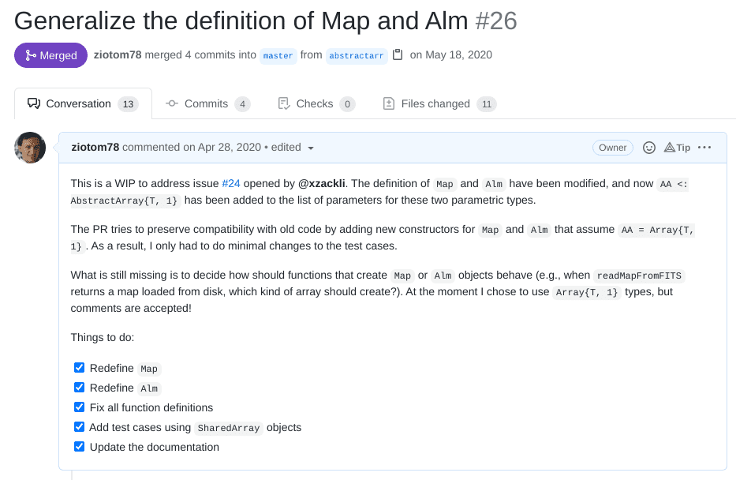

<center>
{height=720px}
</center>

---

<center>
{height=720px}
</center>

---

<center>
{height=720px}
</center>

# Pull requests

# Come funziona Git

-   Stiamo usando Git da alcune settimane, e dovremmo aver imparato come funziona.

-   Abbiamo visto in particolare che Git salva ogni modifica del codice (il *commit*) legandola alla modifica precedente:

    <center>
    
    </center>
    
-   Oggi vedremo che questa struttura lineare può in realtà essere più complicata.

# Modifiche complesse

-   Nelle scorse lezioni abbiamo implementato il codice per leggere e scrivere file PFM.

-   Ciascuno dei gruppi ha implementato questa funzionalità tramite una serie di commit.

-   Questi commit erano *logicamente* legati tra loro, ma ciò non appare quando si apre la pagina dei commit di uno qualsiasi dei vostri repository (v. slide seguente).

---

<center>

</center>

# Branch

-   Git implementa il concetto di *branch* («ramo»), che è un modo di separare una sequenza di commit dal «tronco» principale del *master*:

    <center>
    
    </center>
    
-   Tramite il comando `git branch NOME` si cambia il branch attivo; `git commit` aggiunge sempre in coda a questo branch.

-   `HEAD` punta sempre all'ultimo commit del branch attivo.

# Esempio di branch

<asciinema-player src="cast/git-branch-84x25.cast" cols="84" rows="25" font-size="medium"></asciinema-player>

# Comandi per branch

-   `git branch` elenca i branch (di default, all'inizio c'è solo `master`).

-   `git checkout -b NOME` crea un nuovo branch e lo rende attivo.

-   `git checkout -b NOME` rende attivo un branch già esistente.

-   `git merge NOME1 NOME2` incorpora le modifiche al branch `NOME1` dentro il branch `NOME2`; di solito `NOME2` è `master`.

-   `git branch -d NOME` cancella un branch.

-   Quando eseguite `git fetch` o `git pull` per scaricare nuovi commit da GitHub, vengono importati tutti i branch.

# Branch in GitHub

-   GitHub permette di navigare all'interno dei branch tramite un bottone dedicato:

    <center>
    {height=440px}
    </center>
    
-   La vera potenza dei branch sta però nei *pull request*.

# Pull request in GitHub

-   Un *pull request* è una richiesta di eseguire un comando `git merge` all'interno di `master`.

-   GitHub attiva un forum per ogni pull request, in modo che gli sviluppatori possano commentare l'opportunità o meno di eseguire `git merge`.

-   Nel momento in cui si fa il *merging*, è possibile (e consigliato) applicare lo *squashing*, che consiste nel fondere insieme tutti i commit in uno solo.

-   Lo *squashing* è utilissimo per levare di mezzo i tanti commit con messaggi «*Small fixes*», «*Oops I forgot to add this*», etc.

# Esempio di Pull request

<iframe src="https://player.vimeo.com/video/535144283?badge=0&amp;autopause=0&amp;player_id=0&amp;app_id=58479" width="1440" height="622" frameborder="0" allow="autoplay; fullscreen; picture-in-picture" allowfullscreen title="How to create pull requests in GitHub"></iframe>

# Altro esempio

<center>

</center>

# Come usarli in pratica

-   Se uno di voi crea un pull request su GitHub, gli altri possono aggiungere commit a quel pull request con i comandi

    ```text
    git fetch
    git checkout NOME_PULL_REQUEST
    ```
    
    come se fosse un branch creato da loro stessi (`git fetch` scarica da GitHub tutti i nuovi branch, inclusi i pull request).

-   I pull request sono una delle caratteristiche fondamentali di GitHub!

-   Abituatevi ad usarli per ogni modifica «seria» del vostro codice (no, correggere un errore grammaticale nel `README.md` non rientra nella casistica).

# Link a Gather

Useremo il solito link: [gather.town/app/CgOtJvyNfVKMIQ9e/LaboratorioRayTracing](https://gather.town/app/CgOtJvyNfVKMIQ9e/LaboratorioRayTracing)

# Guida per l'esercitazione

# Guida per l'esercitazione

-   Iniziate col «rilasciare» la *release* 0.1.0 di quanto avete scritto sinora.

-   Uno di voi crei un nuovo pull request chiamato `geometry`, e gli altri invochino `git fetch` seguito da `git checkout geometry`.

-   Fate tutto il lavoro previsto per oggi e per la settimana prossima nel branch `geometry`.

-   Implementate questi tipi:

    #.  `Vec` (un vettore tridimensionale), che rappresenterà anche le normali.
    #.  `Point` (un punto tridimensionale).
    
# Metodi per `Vec`

#. Conversione a stringa, es., `Vec(x=0.4, y=1.3, z=0.7)`;
#. Confronto tra vettori (per i test), usando funzioni come `are_close`;
#. Somma tra vettori;
#. Differenza di vettori;
#. Prodotto per uno scalare;
#. Prodotto scalare tra due vettori;
#. Prodotto vettoriale;
#. Calcolo di $\left\|v\right\|^2$ (`squared_norm`) e di $\left\|v\right\|$ (`norm`);
#. Funzione che normalizza il vettore: $v \rightarrow v / \left\|v\right\|$.

# Metodi per `Point`

#. Conversione a stringa, es., `Point(x=0.4, y=1.3, z=0.7)`;
#. Confronto tra punti (per i test);
#. Somma tra `Point` e `Vector`, restituendo un `Point`;
#. Differenza tra due `Point`, restituendo un `Vector`;
#. Differenza tra `Point` e `Vector`, restituendo un `Point`;

# Implementazione Python

-   L'implementazione Python nel repository [pytracer](https://github.com/ziotom78/pytracer) mostra come implementare `Point` e `Vec`.

-   Attenzione però: Python è un linguaggio *dinamico*, e permette di fare cose che non sono direttamente traducibili in altri linguaggi.

-   Questo è evidente nell'implementazione di metodi che sono molto simili tra `Point` e `Vec`, come la somma di due elementi:

    #. `Point` + `Vec` → `Point`;
    #. `Vec` + `Vec` → `Vec`.

# Implementazione Python

```python
def _are_xyz_close(a, b):
    # This works thanks to Python's duck typing. In C++ and other languages
    # you should probably rely on function templates or something like
    return are_close(a.x, b.x) and are_close(a.y, b.y) and are_close(a.z, b.z)

def _add_xyz(a, b, return_type):
    # Ditto
    return return_type(a.x + b.x, a.y + b.y, a.z + b.z)

def _sub_xyz(a, b, return_type):
    # Ditto
    return return_type(a.x - b.x, a.y - b.y, a.z - b.z)
```

# Implementazione Python

```python
@dataclass
class Vec:
    x: float = 0.0
    y: float = 0.0
    z: float = 0.0

    def is_close(self, other):
        assert isinstance(other, Vec)
        return _are_xyz_close(self, other)

    def __add__(self, other):
        return _add_xyz(self, other, Vec)

    def __sub__(self, other):
        return _sub_xyz(self, other, Vec)
```

# Altre operazioni su `Vec`

```python
def dot(self, other):
    return self.x * other.x + self.y * other.y + self.z * other.z

def squared_norm(self):
    return self.x ** 2 + self.y ** 2 + self.z ** 2

def norm(self):
    return math.sqrt(self.squared_norm())

def cross(self, other):
    return Vec(x=self.y * other.z - self.z * other.y,
               y=self.z * other.x - self.x * other.z,
               z=self.x * other.y - self.y * other.x)

def normalize(self):
    norm = self.norm()
    x /= norm
    y /= norm
    z /= norm
```

# Test

-   Il set completo di test si trova nel repository [pytracer](https://github.com/ziotom78/pytracer), nel file [test_all.py](https://github.com/ziotom78/pytracer/blob/41878248890338e62aa38c928c17561490c901b6/test_all.py#L202-L232).

-   Implementate gli stessi test presenti in quel file.

# Lavoro di gruppo

#. Uno di voi crea la *release* 0.1.0;
#. Uno di voi crea un branch `geometry` e fa un *pull request*, che gli altri scaricano;
#. Uno di voi implementa il tipo `Vec` (senza metodi o operatori!);
#. Uno di voi implementa il tipo `Point` (idem);
#. Sincronizzatevi tra voi facendo un *merge*;
#. Dividetevi l'implementazione dei vari metodi ed operatori.

# Indicazioni per C++

# Definizione dei tipi

-   È importante che `Vec` e `Point` siano efficientissimi!
-   Non preoccupatevi di definire classi con metodi `GetX`/`SetX` e compagnia: definite i tipi `Vec` e `Point` come delle semplici `struct`, oppure `class` con membri `x`, `y`, `z` pubblici.
-   Preoccupatevi di implementare sia costruttori di copia che *move constructor*.
-   Definite la maggior parte delle funzioni come `inline` (ossia, dichiarandole all'interno della classe nel file `.h`).

# Modo sconsigliato

```c++
class Vec {
    // These are "private" members (the default visibility in "class")
    float x, y, z;  // You can use "double", if you wish
    
public:
    Vec(float _x = 0, float _y = 0, float _z = 0) : x{_x}, y{_y}, z{_z} {}
    Vec(const Vec &); // Copy constructor
    Vec(const Vec &&); // Move constructor
    
    float getx() const { return x; }
    void setx(float _x) { x = _x; }
    // Etc.
};
```

# Modo consigliato

```c++
struct Vec {  // With "struct", everything is "public" by default
    float x, y, z;  // You can use "double", if you wish
    
    Vec(float _x = 0, float _y = 0, float _z = 0) : x{_x}, y{_y}, z{_z} {}
    Vec(const Vec &); // Copy constructor
    Vec(const Vec &&); // Move constructor

    // No need to define "getx", "setx", etc.
};
```

# Evitare ripetizioni

-   Potete usare i template C++ per evitare di ridefinire più volte alcune funzionalità comuni tra `Point` e `Vec`.

-   Questo è l'esempio della somma tra due elementi:

    ```c++
    template <typename In1, typename In2, typename Out>
    Out _sum(const In1 &a, const In2 &b) {
      return Out{a.x + b.x, a.y + b.y, a.z + b.z};
    }

    Point operator+(const Point &a, const Vec &b) {
      return _sum<Point, Vec, Point>(a, b);
    }

    Vec operator+(const Vec &a, const Vec &b) {
      return _sum<Vec, Vec, Vec>(a, b);
    }
    ```

# Indicazioni per C\#

# Definizione dei tipi

-   Siccome `Vec` e `Point` saranno molto utilizzati nei calcoli, è importante che siano classi estremamente efficienti.
-   Questo è quindi un caso in cui è meglio definire i tipi come *value types* usando `struct` anziché `class`.
-   Purtroppo C\# non implementa un meccanismo simile a quello dei `template` del C++, quindi dovrete definire due volte le operazioni comuni tra `Point` e `Vec`, come la somma.

# Indicazioni per Julia

# Definizione dei tipi

-   Per definire i tipi `Vec` e `Point` potreste usare la libreria [StaticArrays.jl](https://github.com/JuliaArrays/StaticArrays.jl), che implementa array di dimensione fissata molto efficienti. È una libreria molto efficiente, ma **non vi consiglio di usarla in questo caso**.
-   Il problema di StaticArrays.jl è che non permette di implementare il multiple dispatch: `Vec` e `Point` sarebbero visti da Julia come lo stesso tipo `SVector{3, Float32}`.
-   Meglio definire due nuovi tipi con `struct`
-   Vi consiglio di omettere `mutable`: incoraggerete Julia a usarli come *value types* anziché *reference types*.

# Indicazioni per Kotlin

-   Nessuna indicazione in particolare: l'implementazione di `Point` e `Vec` dovrebbe essere abbastanza semplice.
-   Come il C\#, neppure Kotlin supporta la metaprogrammazione (il caso di `template` in C++), quindi dovrete duplicare un po' di funzioni, come quelle che calcolano `Point + Vec` e `Vec + Vec`.
