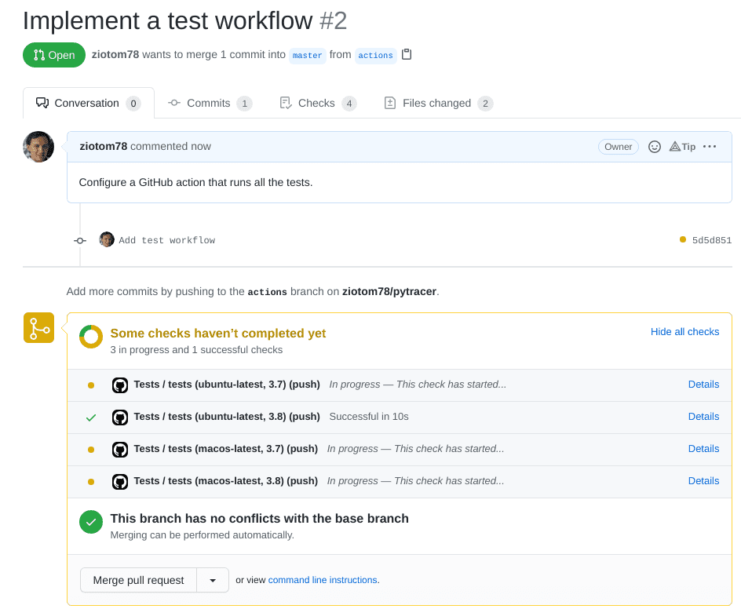
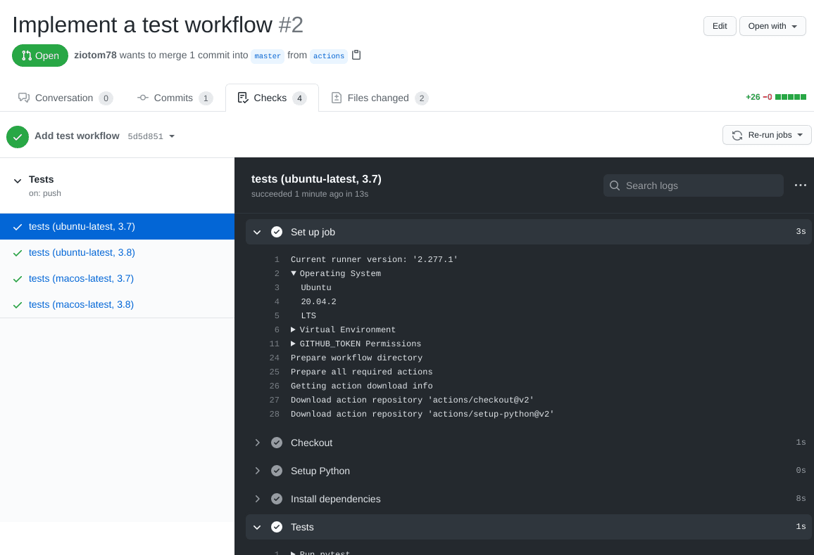
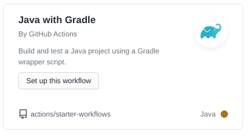

<center>
{height=720px}
</center>

---

<center>
{height=720px}
</center>

# Matrici e trasformazioni

# Trasformazioni

-   Oggi implementeremo il tipo `Transformation`, che codifica una trasformazione.

-   Noi considereremo solo traslazioni, rotazioni attorno ai tre assi coordinati e trasformazioni di scala: questo ci semplificherà molto il lavoro!

-   Le trasformazioni possono essere applicate a tre oggetti matematici:

    #.  Punti (oggetti di tipo `Point`);
    #.  Vettori (oggetti di tipo `Vec`);
    #.  Normali (lo vedremo oggi!).
    
# Il tipo `Transformation`

-   Vedremo nelle prossime lezioni che è spesso necessario avere a portata di mano sia la matrice $M$ (che implementa la trasformazione) che la sua inversa $M^{-1}$.

-   Il nostro tipo `Transformation` dovrà quindi tenere in memoria *entrambe* le matrici:

    ```python
    class Transformation:
        def __init__(self, m=IDENTITY_MATR4x4, invm=IDENTITY_MATR4x4):
            self.m = m
            self.invm = invm
    ```
    
    dove `IDENTITY_MATR4x4` è la matrice identità di dimensioni 4×4.

# Consistenza

-   Ovviamente, il fatto che dobbiamo passare sia $M$ che $M^{-1}$ pone un problema di consistenza! Come facciamo a sapere che i due parametri del costruttore siano corretti?

-   Implementiamo un metodo che verifica che il prodotto delle due matrici dia la matrice identità 4×4:

    ```python
    def is_consistent(self):
        prod = _matr_prod(self.m, self.invm)
        return _are_matr_close(prod, IDENTITY_MATR4x4)
    ```
    
    dove `_matr_prod` e `_are_matr_close` sono semplici metodi che operano su matrici 4×4.
    
# Trasformazioni standard

-   Definiamo una serie di funzioni che costruiscono oggetti `Transformation` preoccupandosi di passare i valori giusti per $M$ e $M^{-1}$.

-   Ad esempio, questa è l'implementazione di `translation` (traslazione per un vettore $\vec v$):

    ```python
    def translation(vec):
        return Transformation(
            m=[[1.0, 0.0, 0.0, vec.x],
               [0.0, 1.0, 0.0, vec.y],
               [0.0, 0.0, 1.0, vec.z],
               [0.0, 0.0, 0.0, 1.0]],
            invm=[[1.0, 0.0, 0.0, -vec.x],
                  [0.0, 1.0, 0.0, -vec.y],
                  [0.0, 0.0, 1.0, -vec.z],
                  [0.0, 0.0, 0.0, 1.0]],
        )
    ```

# Inversa

-   Vedremo che è spesso necessario accedere anche all'inversa di una trasformazione.

-   Fortunatamente, dato che manteniamo in memoria sia $M$ che $M^{-1}$, questo compito è molto facile:

    ```python
    def inverse(self):
        return Transformation(m=self.invm, invm=self.m)
    ```

# Prodotti

-   È particolarmente critico implementare le funzioni per applicare una trasformazione a un oggetto geometrico.!

-   Settimana scorsa abbiamo implementato `Point` e `Vec`; dobbiamo ora implementare gli operatori di prodotto su questi oggetti:

    #.  `Transformation * Transformation → Transformation`; nel calcolare `invm`, ricordate che $(AB)^{-1} = B^{-1}A^{-1}$.
    #.  `Transformation * Point → Point`.
    #.  `Transformation * Vec → Vec`.

-   È conveniente anche implementare un tipo `Normal`, perché la trasformazione di una normale è delicata: $\hat n' = \bigl(M^{-1}\bigr)^t \hat n$.

# Punti e vettori

-   La differenza tra punti e vettori sta nell'ultimo coefficiente della rappresentazione:

    $$
    P = \begin{pmatrix}
    p_x\\
    p_y\\
    p_z\\
    1
    \end{pmatrix},
    \vec v = \begin{pmatrix}
    v_x\\
    v_y\\
    v_z\\
    0
    \end{pmatrix}.
    $$

-   Dal punto di vista del codice, è meglio implementare *due* funzioni distinte per il prodotto: quella relativa ai vettori può risparmiare di iterare sull'ultima colonna delle matrici $M$ e $M^{-1}$.

# Trasformazione di un punto

```python
row0, row1, row2, _ = self.invm
newp = Point(x=p.x * row0[0] + p.y * row0[1] + p.z * row0[2] + row0[3],
             y=p.x * row1[0] + p.y * row1[1] + p.z * row1[2] + row1[3],
             z=p.x * row2[0] + p.y * row2[1] + p.z * row2[2] + row2[3])
w = p.x * row3[0] + p.y * row3[1] + p.z * row3[2] + row3[3]

if w == 1.0:
    return newp   # Avoid three (potentially costly) divisions if not needed
else:
    return Point(newp.x / w, newp.y / w, newp.z / w)
```

# Normalizzazione

-   Nel caso in cui l'ultimo coefficiente del risultato non sia uguale a 1, è necessario normalizzare gli altri termini:

    $$
    \begin{pmatrix}
    p_x\\
    p_y\\
    p_z\\
    \lambda
    \end{pmatrix} \rightarrow
    \begin{pmatrix}
    p_x / \lambda\\
    p_y / \lambda\\
    p_z / \lambda\\
    1
    \end{pmatrix}
    $$

-   Non spiegheremo il motivo di tale normalizzazione; ci limitiamo ad assumere che sia giusta.

# Normali

-   Implementiamo anche un semplice tipo `Normal`, che ha struttura identica a `Vec` ma che per il momento non richiede tutti i metodi (somma, prodotto scalare, etc.):

    ```python
    @dataclass
    class Normal:
        x: float = 0.0
        y: float = 0.0
        z: float = 0.0
    ```

-   Una trasformazione applicata a una normale è identica all'applicazione di un vettore, ma bisogna usare la *trasposta* dell'*inversa*. Vediamo come si fa il calcolo.

# Inversa trasposta

-   La matrice omogenea $M$ può essere rappresentata a blocchi:

    $$
    M = \begin{pmatrix}
    \textcolor{#3434AD}{A}& \textcolor{#34AD34}{\vec v}\\
    \mathbf{0}& 1,
    \end{pmatrix}
    $$
    
    dove $\textcolor{#3434AD}{A}$ è una matrice 3×3.

-   Si può [dimostrare facilmente](https://en.wikipedia.org/wiki/Invertible_matrix#Blockwise_inversion) che l'inversa di una matrice omogenea è ancora una matrice omogenea.

# Inversa trasposta

-   La trasposta di una matrice omogenea non è però più omogenea, perché compaiono valori non nulli nell'ultima riga:

    $$
    M^t = \begin{pmatrix}
    \textcolor{#3434AD}{m_{11}}& \textcolor{#3434AD}{m_{21}}& \textcolor{#3434AD}{m_{31}}& 0\\
    \textcolor{#3434AD}{m_{12}}& \textcolor{#3434AD}{m_{22}}& \textcolor{#3434AD}{m_{32}}& 0\\
    \textcolor{#3434AD}{m_{13}}& \textcolor{#3434AD}{m_{23}}& \textcolor{#3434AD}{m_{33}}& 0\\
    \textcolor{#34AD34}{v_1}& \textcolor{#34AD34}{v_2}& \textcolor{#34AD34}{v_3}& 1\\
    \end{pmatrix}.
    $$

-   Esplicitando il prodotto tra l'inversa trasposta e un vettore, si vede che l'ultimo coefficiente (omogeneo) non è più 0!

-   Questo però **non influisce** su $\hat n'$, e possiamo quindi ignorare il problema.

# Implementazione

-   Il codice di [pytracer](https://github.com/ziotom78/pytracer) implementa il prodotto tra matrice e normale nel modo più diretto possibile:

    ```python
    row0, row1, row2, _ = self.invm
    return Normal(x=n.x * row0[0] + n.y * row1[0] + n.z * row2[0],
                  y=n.x * row0[1] + n.y * row1[1] + n.z * row2[1],
                  z=n.x * row0[2] + n.y * row1[2] + n.z * row2[2])
    ```

-   È inutile infatti costruire la matrice trasposta di `self.invm` e calcolare il prodotto di questa con la normale.


# Guida per l'esercitazione

# `Transformation`

-   Continuate a lavorare nella pull request `geometry`.

-   Implementate un semplice tipo `Normal`.

-   Implementate il tipo `Transformation`, che possa essere costruito da una matrice 4×4 e dalla sua inversa. (Fatelo agile come `Vec`, `Point`, etc.)

-   Implementate le seguenti operazioni:

    #.  Metodo `is_close` o funzione `are_close` per `Transformation`;
    #.  Prodotto con `Transformation`, `Vec`, `Point` e `Normal`;
    #.  Inversa;
    #.  Funzioni `translation`, `scaling`, e le tre rotazioni attorno a $x$, $y$ e $z$.


# Test

-   Fate riferimento al [file test_all.py di pytracer](https://github.com/ziotom78/pytracer/blob/351213037ecf14e380530194b89b4190d984aa87/test_all.py#L241-L368) per vedere come sono implementati i test.

-   Preoccupatevi di verificare che **tutti** i test passino: le operazioni in `Transformation` sono fondamentali per il codice che scriveremo le prossime volte, e non devono esserci errori.

-   Una volta che avete implementato tutte le funzionalità e tutti i test passano, fate il merge del pull request.


# Workflow in GitHub

-   Aggiungete un *workflow* al vostro repository GitHub.

-   Ci sono molti template disponibili in GitHub: scegliete il più appropriato.

-   Il workflow deve eseguire le seguenti azioni:

    1.  Scaricare il codice dal repository GitHub (verifica che non manchino file);
    2.  Compilare il codice (verifica che non ci siano errori di sintassi);
    3.  Eseguire i test (verifica che il codice funzioni a dovere).

-   Modificate un test in modo che fallisca e verificate che quando fate il commit ciò vi venga segnalato. (Poi rimettete a posto il test).

# Indicazioni per il C++

# GitHub Actions

-   Una volta salvato il codice in un repository su GitHub, configurate una nuova «Action» (v. video seguente).

-   Il modello è «CMake based projects» (ignorate il fatto che sembri supportare solo il linguaggio C):

    <center>
    
    </center>
    
---

<iframe src="https://player.vimeo.com/video/520878087?badge=0&amp;autopause=0&amp;player_id=0&amp;app_id=58479" width="1280" height="720" frameborder="0" allow="autoplay; fullscreen; picture-in-picture" allowfullscreen title="Setting up GitHub Actions for CMake-based projects"></iframe>

# Esecuzione dei test

-   Modificate uno dei test che sono già implementati nel vostro codice, in modo che fallisca:

    -   Cambiate il codice del test e modificate il valore atteso per un test;
    -   Andate nella directory `build` ed eseguite `ctest`, verificando il fallimento;
    -   Fate il commit delle modifiche;
    -   Inviate le modifiche a GitHub col comando `git push`.

 -  Cosa succede al *CI build*? Fallisce come vi aspettavate?

# Suggerimenti

-   Se il build **non** fallisce, è probabilmente perché viene usato come tipo di build il `Release` anziché il `Debug`, e avete usato `assert` nel vostro codice.
-   Soluzioni:
    -   Cambiate il file `.yml` in modo da usare `Debug` anziché `Release`
    -   Usate `#undef NDEBUG` prima di `#include <cassert>` (meglio!)
    -   Definite una vostra funzione `my_assert` (ancora meglio!)
    -   Usate una libreria di testing C++, come [Catch2](https://github.com/catchorg/Catch2/tree/v2.x) (ottimo!)
-   Insegnamento: provare **sempre** a far fallire uno o più test quando si configura un *CI build*!

# Indicazioni per C\#

# GitHub Actions

-   Aggiungete una Action al repository GitHub, una volta che avete fatto il commit ed eseguito `git push`.

-   Il modello è «.NET» (evitate il modello «.NET desktop», a noi serve quello per i programmi che funzionano da linea di comando):

    <center>
    
    </center>

# Indicazioni per Julia

# GitHub Actions

-   A differenza del C++ e del C\#, Julia non ha una action preconfigurata nel sito.
-   Ma GitHub gestisce un «marketplace», e il team Julia l'ha usato per fornire alla comunità una [serie di actions](https://github.com/julia-actions).
-   Le azioni che servono sono le seguenti:
    - `julia-actions/setup-julia@v1` (installa Julia);
    - `actions/cache@v1` (evita di reinstallare pacchetti Julia ogni volta)
    - `julia-actions/julia-buildpkg@latest` (compila il package)
    - `julia-actions/julia-runtest@latest` (esegue i test)


# File `UnitTests.yml`

```yaml
name: Unit tests

on:
  push:
    branches:
      - master

jobs:
  test:
    name: Julia ${{ matrix.julia-version }} - ${{ matrix.os }} - ${{ matrix.arch }}
    runs-on: ${{ matrix.os }}
    strategy:
      matrix:
        julia-version:
          - '1.5'
        os:
          - ubuntu-latest
        arch:
          - x64

    steps:
      - uses: actions/checkout@v2

      - name: "Set up Julia"
        uses: julia-actions/setup-julia@v1
        with:
          version: ${{ matrix.julia-version }}
          arch: ${{ matrix.arch }}

      - name: "Cache artifacts"
        uses: actions/cache@v1
        env:
          cache-name: cache-artifacts
        with:
          path: ~/.julia/artifacts
          key: ${{ runner.os }}-test-${{ env.cache-name }}-${{ hashFiles('**/Project.toml') }}
          restore-keys: |
            ${{ runner.os }}-test-${{ env.cache-name }}-
            ${{ runner.os }}-test-
            ${{ runner.os }}-

      - name: "Build package"
        uses: julia-actions/julia-buildpkg@latest

      - name: "Run unit tests"
        uses: julia-actions/julia-runtest@latest
```

# Indicazioni per Kotlin


# GitHub Actions

-   Selezionate «Java with Gradle»:

    <center>
    
    </center>
    
    Gradle scaricherà automaticamente il supporto Kotlin.

-   Il processo proverà a compilare il codice e a eseguire *tutti* i test nel repository

# Risoluzione dei problemi

-   Ricordatevi di aggiungere al commit i file in `gradle/wrapper/`

-   Se avete problemi a causa della versione di Gradle, rigenerate `gradlew` da linea di comando così:

    ```sh
    gradle wrapper --gradle-version 5.3
    ```
    
    (Gradle supporta Kotlin a partire dalla versione 5.3).
