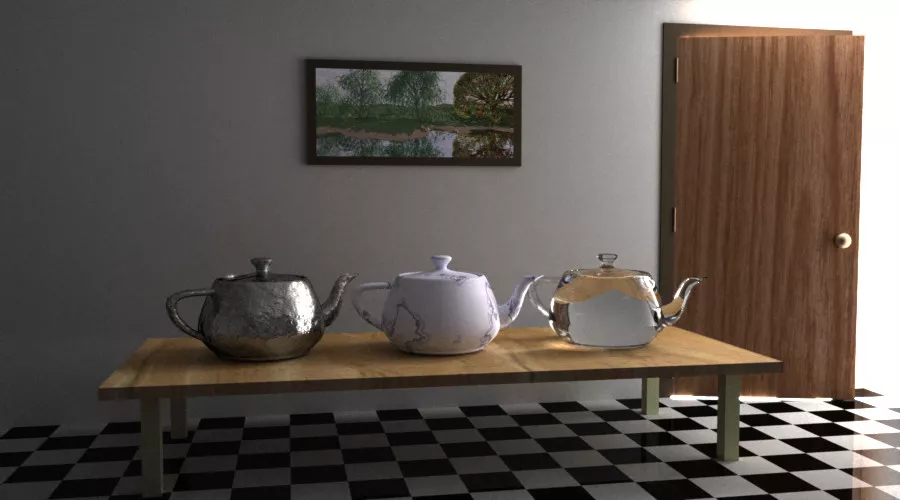
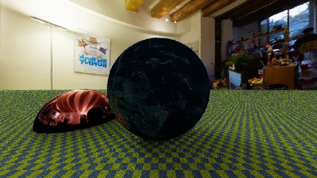
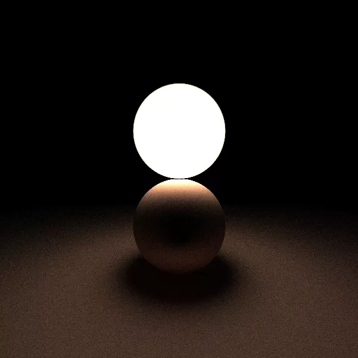
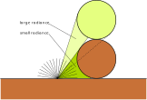
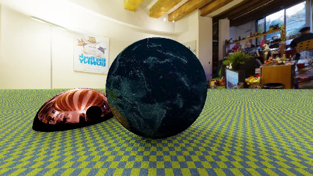
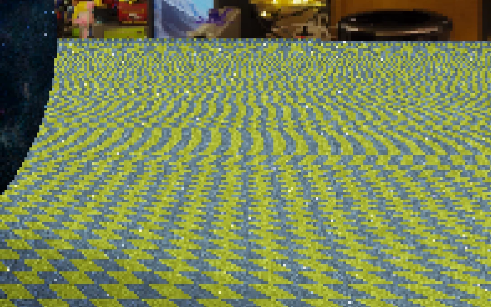
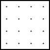
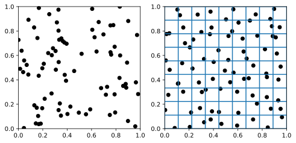
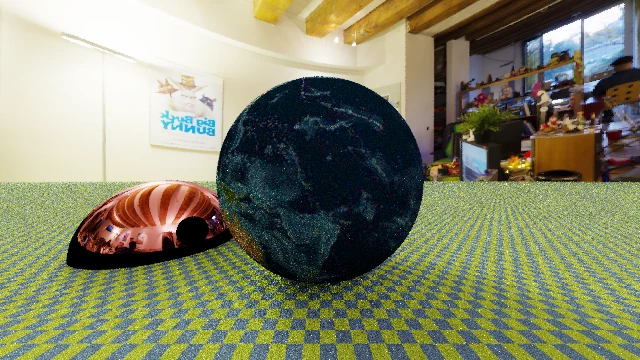

```python
def radiance(self, ray: Ray, num_of_samples=100) -> Color:
    hit_record = self.world.ray_intersection(ray)
    material = get_material(hit_record)
    emitted_radiance = material.get_emitted_radiance(hit_record.surface_point)

    # Estimate the integral using Monte Carlo
    cum_radiance = Color(0.0, 0.0, 0.0)
    for i in range(num_of_samples):
        # Start a new (secondary) ray and compute the radiance along it
        mc_ray = scatter_ray(..., depth=ray.depth + 1)
        # Recursive call! Will it ever stop?
        mc_radiance = radiance(mc_ray, num_of_samples=num_of_samples)
        cum_radiance += material.brdf(...) * mc_radiance

    return emitted_radiance + cum_radiance * (2 * pi) / num_of_samples
```

# Fermare la ricorsione

-   Il criterio più semplice è quello di fissare un numero massimo di iterazioni: dopo tre o quattro chiamate ricorsive, si arresta l'iterazione:

    ```python
    hit_record = self.world.ray_intersection(ray)
    material = get_material(hit_record)
    emitted_radiance = material.get_emitted_radiance(hit_record.surface_point)

    cum_radiance = Color(0.0, 0.0, 0.0)
    if ray.depth > 5:
        # Compute the MC integral only if we have not gone too deep
        for i in range(num_of_samples):
            ....

    # If ray.depth > 5, then "cum_radiance" is zero
    return emitted_radiance + cum_radiance * (2 * pi) / num_of_samples
    ```

-   Questo è un metodo efficace per limitare il tempo di calcolo. Ma è corretto?

# Fermare la ricorsione

-   Anche se è un metodo molto usato, attribuire alla radianza un valore nullo se `ray.depth` supera una soglia *non* è fisicamente corretto!

-   Dal momento che $L(x \leftarrow \Psi) \geq 0$ infatti, «troncare» il contributo dell'integrale dopo un certo numero di iterazioni vuol dire **sottostimare** il valore dell'integrale: se si sottostima la radianza, si introduce un *bias* nella soluzione.

-   La situazione è uguale a quella in cui si stima il valore di $\sum_{n=0}^\infty \frac1{n!} = e$ sommando solo i primi $N$ termini: ovviamente la stima sarà per difetto, e l'errore sarà tanto più grave quanto è piccolo $N$.

-   È importante? Dipende!

# {data-transition="none"}

<center></center>

[Big Hero 6 (Walt Disney Animation Studios, 2014), 2 riflessioni]{style="float:right"}

# {data-transition="none"}

<center></center>

[Big Hero 6 (Walt Disney Animation Studios, 2014), 9 riflessioni]{style="float:right"}

---

<center></center>

[[*Metropolis Light Transport*](https://graphics.stanford.edu/papers/metro/), Veach & Guibas (1997)]{style="float:right"}

# Roulette russa

-   Un algoritmo molto usato nel path-tracing è la *roulette russa*, che rimuove completamente il *bias*, ossia la sottostima della radianza, al prezzo però di aumentare il rumore scorrelato (bianco).

-   Il procedimento richiede di fissare una probabilità $0 \leq q \leq 1$ e una costante $c$ (solitamente $c = 0$), e procede nel modo seguente:

    #.  Si estrae un numero casuale $0 \leq x \leq 1$;
    #.  Se $x > q$, si procede a calcolare la radianza $L$ e si restituisce $(L - q c) / (1 - q)$;
    #.  Se $x \leq q$, si ferma il calcolo e si restituisce $c$.

---

-   Per quale motivo la roulette russa dovrebbe rimuovere il bias? Proviamo a calcolare il valore di aspettazione della radianza.

-   Il metodo sostituisce la radianza $L$ con una radianza casuale $L'$ così fatta:

    $$
    L' = \begin{cases}
    \frac{L - q c}{1 - q}\ &\text{se $x > q$},\\
    c&\text{altrimenti}.
    \end{cases}
    $$
    
    $L'$ ha valore di aspettazione
    
    $$
    E[L'] = E\left[(1 - q) \frac{L - q c}{1 - q} + q c\right] = E[L].
    $$

# Significato intuitivo

-   Se supponiamo $c = 0$, otteniamo che

    $$
    L' = \begin{cases}
    \frac{L}{1 - q}\ &\text{se $x > q$},\\
    0&\text{altrimenti}.
    \end{cases}
    $$

-   Questo risultato è intuitivo da comprendere: c'è una probabilità $q$ di restituire zero, ma se $x > q$ (con probabilità $1 - q$) si restituisce «qualcosa di più» di $L$ (perché $1 / (1 - q) > 1$) per compensare quanto si perderebbe nel primo caso.

# Svantaggi

-   La roulette russa non è una soluzione priva di difetti!

-   Supponete ad esempio di scegliere $q = 0.99$. In questo caso sarà molto difficile restituire $L / (1 - q)$, perché nella maggior parte dei casi si restituirà semplicemente zero.

-   D'altra parte, le poche volte in cui si restituisce $L / (1 - q)$, si restituirà il valore $L$ moltiplicato per cento volte, ossia $1 / (1 - 0.99)$.

-   Ovviamente questo implica un notevole incremento nella varianza della stima, il che vuol dire che l'immagine risulterà più sgranata, seppure chiaramente *unbiased*.

# Dettagli

-   Per implementare la roulette russa, di solito si fissa una soglia minima al valore di `depth`:

    ```python
    if ray.depth > 5:
        threshold = compute_threshold(...)
        if pcg.random_float() > threshold:
            return radiance / (1 - threshold)
        else:
            return Color(0.0, 0.0, 0.0)
    ```
    
    Questo *non* introduce un bias, ma permette di ridurre il rumore nell'immagine.

-   Qualsiasi valore di $q$ funziona, ma i risultati migliori si ottengono scegliendo il valore massimo tra le componenti R, G, B della BRDF nel punto di intersezione.

# Path tracing all'opera

-   Abbiamo a disposizione tutta la teoria per implementare l'algoritmo di path-tracing!

-   Il numero $N$ di campioni (direzioni) usati per stimare ciascun integrale è un parametro libero, e va scelto a seconda della scena e di quanto è efficiente il path tracer.

-   Supponendo di fissare una soglia a `ray.depth` uguale a $m$ riflessioni, il numero totale $N_\text{tot}$ di raggi che il codice deve simulare è $\leq N^m$. Se si sceglie $N = 100$ e $m = 9$ si ottiene $N_\text{tot} = 10^{18}$: è importante non esagerare col valore di $N$!

# $N = 3$ {data-transition="none"}

<center></center>
[726,939 raggi]{style="float:right"}

# $N = 10$ {data-transition="none"}

<center></center>
[5,010,840 raggi]{style="float:right"}

# $N = 25$ {data-transition="none"}

<center></center>
[26,343,150 raggi]{style="float:right"}

# $N = 50$ {data-transition="none"}

<center></center>
[98,875,400 raggi]{style="float:right"}

# $N = 100$ {data-transition="none"}

<center></center>
[382,384,500 raggi]{style="float:right"}

# *Importance sampling*

-   Abbiamo implementato il codice usando il metodo della media per stimare l'integrale, ma questo non è ottimale!

-   Nella scorsa lezione avevamo visto infatti che la varianza del metodo della media può essere ridotta se estraiamo i campioni casuali secondo una distribuzione «furba» $p(\theta, \phi)$.

-   Quale distribuzione potrebbe essere «furba» qui?

# *Importance sampling*

-   Scriviamo ancora una volta l'integrale dell'equazione del rendering:

    $$
    \int_{2\pi} f_r(x, \Psi \rightarrow \Theta)\,L(x \leftarrow \Psi)\,\cos(N_x, \Psi)\,\mathrm{d}\omega_\Psi.
    $$
    
-   Supponiamo di metterci nel sistema di riferimento in cui $\theta$ e $\phi$ sono misurati rispetto all'asse della normale $N_x$; allora l'angolo tra $N_x$ e $\Psi$ è proprio $\theta$, e quindi

    $$
    \int_{2\pi} f_r(x, \Psi \rightarrow \Theta)\,L(x \leftarrow \Psi)\,\cos\theta\,\mathrm{d}\omega_\Psi.
    $$

# Possibilità

$$
\int_{2\pi} 
\textcolor{#ad3434}{f_r(x, \Psi \rightarrow \Theta)}\,
\textcolor{#34ad34}{L(x \leftarrow \Psi)}\,
\textcolor{#3434ad}{\cos\theta}\,
\mathrm{d}\omega_\Psi.
$$

-   Per scegliere una distribuzione «furba», dovremmo cercare una $p(x)$ che assomigli all'integranda ma sia nel contempo facile da normalizzare.

-   Ci sono tre termini nell'integranda, che dobbiamo capire come combinare in una $p(\omega)$:

    #.  $\textcolor{#ad3434}{f_r(x, \Psi \rightarrow \Theta)}$;
    #.  $\textcolor{#34ad34}{L(x \leftarrow \Psi)}$;
    #.  $\textcolor{#3434ad}{\cos\theta}$.

# Implementazione

-   Una soluzione è quella di scegliere $p(\omega) \propto \cos\theta$. Il senso intuitivo è che «paga» di più scegliere le direzioni più allineate lungo la normale (ossia con $\theta$ piccolo), perché è da lì che proviene la maggior parte della radianza.

-   Una soluzione migliore però è quella di scegliere

    $$
    p(\omega) \propto f_r(x, \Psi \rightarrow \Theta) \cos\theta,
    $$
    
    perché la stessa funzione $f_r$ può avere forti dipendenze dalla direzione, come nel caso di superfici riflettenti.

# BRDF diffusa

-   Su una superficie diffusiva la radiazione incidente è diffusa su 2π, e vale che

    $$
    f_r(x, \Psi \rightarrow \Theta) = \frac{\rho_d}\pi.
    $$
    
-   Di conseguenza, per usare l'*importance sampling* occorre trovare una PDF $p(\omega)$ tale che

    $$
    p(\omega) \propto \frac{\rho_d}\pi\,\cos\theta \propto \cos\theta.
    $$
    
    Questo risultato è riconducibile alla [distribuzione di Phong](tomasi-ray-tracing-10a.html#/distribuzione-di-phong) ($\propto \cos^n\theta$).
    
---

Nel caso di una superficie diffusa vale che

$$
\begin{aligned}
&\int_{2\pi} f_r(x, \Psi \rightarrow \Theta)\,L(x \leftarrow \Psi)\,\cos(N_x, \Psi)\,\mathrm{d}\omega_\Psi \approx\\
\approx&\frac1N\sum_{i=1}^N \frac{f_r(x, \Psi_i \rightarrow \Theta)\,L(x \leftarrow \Psi_i)\,\cos\theta}{p(\omega)} =\\
=&\frac{\rho_d}{N}\sum_{i=1}^N L(x \leftarrow \Psi_i),
\end{aligned}
$$

dove ovviamente è necessario che le $\Psi_i$ siano distribuite secondo $p(\omega) \propto \cos\theta$.

# Uso delle BRDF

-   Fissato un certo numero $N$ di raggi con cui calcolare l'integrale, l'uso dell'*importance sampling* permette di ridurre la varianza: a parità di $N$, con l'*importance sampling* l'immagine è meno rumorosa.

-   Notiamo che se usiamo l'*importance sampling* per valutare l'integrale, **non** è necessario che il codice calcoli in maniera esplicita il valore di $f_r$: questo si semplifica nell'espressione!

-   Il prezzo da pagare è che però bisogna generare direzioni casuali con distribuzioni che in generale non sono uniformi.

# BRDF riflettente

-   Consideriamo ora la BRDF di uno specchio perfettamente riflettente.

-   Sappiamo già che gli specchi obbediscono alla legge della riflessione:

    <center>{height=320px}</center>
    
    In questo caso la BRDF è ovviamente proporzionale a una Delta di Dirac.

# BRDF riflettente

-   In [*Geometrical Considerations and Nomenclature for Reflectance*](https://graphics.stanford.edu/courses/cs448-05-winter/papers/nicodemus-brdf-nist.pdf) (Nicodemus, Richmond & Hsia, 1977) si dimostra mediante considerazioni energetiche che per una superficie riflettente ideale si ha che

    $$
    f_r(x, \Psi \rightarrow \Theta) \propto \frac{\delta(\sin^2\theta_r - \sin^2\theta)\,\delta(\psi_r \pm \pi - \psi)}{\cos\theta},
    $$
    
    dove $(\theta, \phi)$ è ovviamente la direzione $\Psi$ di arrivo del raggio, e $(\theta_r, \psi_r)$ è la direzione riflessa.
    
-   La presenza di $\cos\theta$ al denominatore fa sì che nell'*importance sampling* $p(\omega)$ non dipenda da $\cos\theta$.

# BRDF riflettente

-   L'implementazione della BRDF riflettente è molto semplice, perché nella valutazione dell'integrale i raggi secondari sono tutti allineati lungo la direzione $(\theta_r, \phi_r)$.

-   Dal punto di vista dei vettori, la legge di riflessione si scrive così:

    $$
    \vec r = 2(\hat n \cdot \Psi) \hat n - \Psi,
    $$

    dove $\vec r$ è il vettore riflesso.


# Basi ortonormali (ONB) arbitrarie


# Direzioni casuali nello spazio

-   Per stimare l'integrale dell'equazione del rendering col metodo della media bisogna generare direzioni casuali con una data distribuzione $p(\omega)$ sull'emisfero 2π.

-   L'emisfero 2π è però definito rispetto alla normale $\hat n$, che può avere un'orientamento arbitrario nello spazio tridimensionale!

-   Se dal punto di vista matematico la generazione di direzioni casuali è chiara, dal punto di vista *implementativo* non è così semplice: bisogna cambiare sistemi di riferimento!

# Sistemi di riferimento

<center></center>

-   Le espressioni che abbiamo ricavato per generare direzioni casuali secondo varie distribuzioni assumono tutte che $\theta$ sia misurato partendo dall'asse $z$.

-   Quando generiamo una direzione casuale in quel sistema di riferimento, dobbiamo quindi poi convertire il vettore nel sistema *globale* con cui sono definiti gli oggetti del «mondo».

-   Il compito è semplice se si usano basi ortonormali (ONB) create *ad hoc*.

# Basi ortonormali

-   Data una base ortonormale (ONB) $\left\{\hat e_1, \hat e_2, \hat e_3\right\}$ e un vettore $\vec v$, vale che

    $$
    \vec v = \sum_{i=1}^3 \left<\vec v, \hat e_i\right> \hat e_i = v_x \hat e_x + v_y \hat e_y + v_z \hat e_z.
    $$
    
-   Se si ha una nuova ONB $\left\{\hat e'_1, \hat e'_2, \hat e'_3\right\}$, il vettore $\vec v'$ ottenuto ruotando $\vec v$ dalla vecchia alla nuova base deve avere le stesse componenti:

    $$
    \vec v' = \sum_{i=1}^3 \left<\vec v', \hat e'_i\right> \hat e'_i = v'_x \hat e'_x + v'_y \hat e'_y + v'_z \hat e'_z = v_x \hat e'_x + v_y \hat e'_y + v_z \hat e'_z.
    $$
    

# ONB arbitrarie

<center></center>

-   Dato un vettore casuale $\vec v = (v_x, v_y, v_z)$ nel sistema di riferimento della normale (ossia dove $\theta = 0$ è allineato con l'asse $z$), possiamo ruotare $\vec v$ in una nuova ONB $\left\{\hat e'_i\right\}$ scrivendo

    $$
    \vec v' = v_x \hat e'_x + v_y \hat e'_y + v_z \hat e'_z.
    $$
    
-   Deve valere che $\hat e'_z = \hat n$, ma l'orientamento di $\hat e'_x$ e $\hat e'_y$ è ininfluente.

# ONB arbitrarie

-   Il modo più semplice per creare una nuova ONB è basarsi sul fatto che da due elementi della base si può sempre ricavare il terzo tramite il prodotto vettoriale:

    $$
    \hat e_x \times \hat e_y = \hat e_z,\quad
    \hat e_y \times \hat e_z = \hat e_x,\quad
    \hat e_z \times \hat e_x = \hat e_y.
    $$

-   Per creare una ONB scegliamo un vettore arbitrario $\vec g$, e poniamo

    $$
    \hat e'_x = \text{norm}(\hat n \times \vec g),\quad
    \hat e'_y = \hat n \times \hat e'_x,\quad
    \hat e'_z = \hat n,
    $$
    
    dove $\text{norm}(\vec v) = \vec v / \left\|\vec v\right\|$ normalizza la lunghezza del vettore.

# Una difficoltà

-   Il metodo per creare una nuova ONB funziona però solo a patto che il vettore arbitrario $\vec g$ non sia allineato con $\hat n$, altrimenti

    $$
    \hat n \times \vec g = 0.
    $$
    
-   Nell'implementazione dell'algoritmo occorre quindi inserire un test, ed eventualmente usare un altro vettore arbitrario $\vec h$. Di solito si sceglie $\vec g = (1, 0, 0)$ e $\vec h = (0, 1, 0)$..

-   [Duff et al. 2017](https://graphics.pixar.com/library/OrthonormalB/paper.pdf), basandosi su [Frisvad, 2012](http://orbit.dtu.dk/files/
126824972/onb_frisvad_jgt2012_v2.pdf), hanno proposto un algoritmo alternativo basato sui quaternioni che richiede la metà del tempo di esecuzione (evita questo controllo e la normalizzazione).

# Duff et al. (2017)

<center></center>

[Gli autori lavorano alla [Pixar Animation Studios](https://www.pixar.com/).]

# Approfondimenti

# Approfondimenti

-   Vediamo ora brevemente alcune possibilità per migliorare l'algoritmo di path tracing:
    -   Illuminazione diretta;
    -   *Photon mapping*;
    -   Antialiasing;
    -   *Point-light tracing*.
-   Se desiderate potete implementare l'antialiasing e il *point-light tracing* nel vostro codice.
-   L'illuminazione diretta e il *photon mapping* vanno ben oltre quanto si possa implementare per questo corso.

# Illuminazione diretta

-   Abbiamo applicato l'*importance sampling* all'equazione del raytracing scrivendo una funzione di probabilità

    $$
    p(\omega) \propto \cos\theta \times f_r.
    $$

-   Questo trucco può migliorare molto la qualità del rendering nel caso di BRDF molto dipendenti da $\theta$, ma non aiuta se il termine

    $$
    L(x \leftarrow \Psi)
    $$
    
    nell'integrale dell'equazione del rendering varia molto. Per ridurre la varianza in questi casi esiste l'algoritmo *(explicit) direct lighting*.

# Caso «facile»

<center></center>

# Caso «difficile»

<center></center>

# Illuminazione diretta

<center></center>

Se la $p(\omega)$ usata nell'*importance sampling* potesse «pesare» la presenza o meno di sorgenti luminose, la convergenza sarebbe molto più rapida!

# Implementazione

-   Per implementare un'ottimizzazione di questo tipo occorre aggiungere un flag al tipo `Material`, che dica se il materiale è un emettitore «significativo» o no.

-   Nel calcolo dell'integrale dell'equazione del rendering, il dominio 2π viene diviso in due parti:

    #.   L'angolo solido $\Omega_\text{lum}$ sotteso da quegli oggetti il cui `Material` ha il flag «emettitore» impostato a `true`;
    #.   L'angolo solido $\Omega_\text{rem}$ restante.
    
-   L'integrale relativo a $\Omega_\text{rem}$ viene calcolato nel modo solito.

# Luminarie

-   L'integrale relativo all'angolo solido $\Omega_\text{lum}$ viene calcolato in un modo speciale.

-   Occorre che ogni `Shape` abbia la possibilità di calcolare il proprio angolo solido (facile per piani, sfere e triangoli, difficile per oggetti CSG!).

-   Inoltre, è necessario un metodo che restituisca una direzione casuale verso l'oggetto emissivo distribuita uniformemente entro il suo angolo solido (facile per sfere e triangoli, difficile per piani e oggetti CSG!).

-   L'implementazione è complicata dal fatto che si devono tenere in conto le costanti di normalizzazione per le varie $p(\omega)$ usate, e le sovrapposizioni di diversi angoli solidi.

# *Photon mapping*

# *Photon mapping*

-   Il *photon mapping* è una tecnica che ottimizza il tempo di calcolo della soluzione dell'equazione del rendering. È illustrato nel libro [*Realistic Image Synthesis Using Photon Mapping*](https://www.routledge.com/Realistic-Image-Synthesis-Using-Photon-Mapping/Jensen/p/book/9781568814629) (Jensen, 2009)

-   È un algoritmo [*forward ray-tracing*](tomasi-ray-tracing-08a-projections.html#/forward-ray-tracing) (l'unico che analizziamo in questo corso!) che viene eseguito in due passaggi:

    #.  Creazione della *photon map*;
    #.  Rendering dell'immagine.

# Fotoni nel «Cornell box»

{height=560}

# Algoritmo di *photon mapping*

-   Per ogni sorgente luminosa si emettono una serie di raggi che dipartono verso direzioni casuali.

-   Ad ogni interazione con una superficie si sceglie con una certa probabilità se creare un *fotone*: questo è un tipo `Photon` che contiene la posizione (un `Point`) e la sua energia (ossia, un campo `Color`).

-   La lista di tutti i `Photon` creati (la *photon map*, appunto) viene memorizzata nel tipo `World` (non è necessario associare un `Photon` alla `Shape` che l'ha prodotto).

-   Per calcolare $L(x \leftarrow \Psi)$ nell'equazione del rendering, si considerano tutti i `Photon` entro una certa distanza $d$ da $x$.

---

<center>{height=480px}</center>

[[*Physically based computer graphics for realistic image formation to simulate optical measurement systems*](https://jsss.copernicus.org/articles/6/171/2017/), Retzlaff et al. (2017)]{style="float:right"}


# Caratteristiche dell'algoritmo

-   Il calcolo dei fotoni può essere riutilizzato per successive esecuzioni dell'algoritmo di *path tracing* (eventualmente salvandolo su disco).

-   La ricerca dei fotoni più vicini a un punto $x$ può essere resa molto rapida usando una struttura KD-Tree (memorizzata direttamente in `World`).

-   È facile usarlo per simulare effetti legati allo spettro della luce (diffrazione da prismi, caustiche, etc.)

-   Di solito si usa il *photon mapping* solo per calcolare la componente luminosa indiretta (ossia, la luce che raggiunge le superfici ma **non** quella che raggiunge direttamente l'occhio dell'osservatore): per quest'ultima si può usare il *path-tracing*.


# Aliasing e antialiasing

# Aliasing

-   Nel tipo `ImageTracer` del nostro ray-tracer abbiamo assunto che il colore di ogni pixel fosse determinato dal colore del raggio [passante per il centro](http://localhost:8000/tomasi-ray-tracing-08a-projections.html#/raggi-per-pixel):

    <center>
    {height=280px}
    </center>

-   Questa assunzione provoca il fenomeno chiamato *aliasing*, causato dalla dimensione finita dei pixel, e alla produzione delle cosiddette [*frange di Moiré*](https://en.wikipedia.org/wiki/Moir%C3%A9_pattern)

---

<center></center>

L'occhio umano tende a notare delle linee ondulate nella trama a scacchiera sul piano.

---

<center></center>

---

<center></center>

Il problema dell'*aliasing* è che certi pixel coprono aree dello schermo che contengono colori diversi.

# Antialiasing

-   Per *antialiasing* si intende un algoritmo che riduca gli artefatti di un'immagine che sono causati da variazioni di colore su scale inferiori del pixel.

-   Un modo semplice per implementare l'*antialiasing* è dotare il nostro tipo `ImageTracer` dell'abilità di campionare un pixel usando più raggi, e calcolando poi la media della radianza associata a ciascuno.

# Antialiasing e MC

-   Non è forse immediato da comprendere, ma i raggi che inviamo all'interno dello stesso pixel **non devono essere equispaziati**, altrimenti il problema delle frange di Moiré si ripresenterebbe ugualmente (sebbene in misura minore):

    <center>{height=240px}</center>

-   Meglio usare un metodo Monte Carlo per campionare l'interno di un pixel.

# *Stratified sampling*

-   Estrarre casualmente punti sul piano $[0, 1] \times [0, 1]$ di un pixel è semplice: basta estrarre sia $u$ che $v$ da una distribuzione uniforme.

-   Il risultato ha però un cattivo comportamento dal punto di vista della varianza, perché è facile che ci siano regioni del pixel poco campionate rispetto ad altre.

-   Lo *stratified sampling* è un semplice metodo per ridurre la varianza: si divide lo spazio del pixel in tanti sotto-quadrati, e si estrae una posizione casuale dentro ciascuno dei quadrati.

---

<center></center>

# Implementazione

-   Lo *stratified sampling* è semplice da implementare, ma pone il vincolo che il numero di raggi sia un quadrato perfetto (1, 4, 9, …).

-   Implementare l'antialiasing con lo *stratified sampling* ha il vantaggio di ridurre molto l'aspetto granuloso delle immagini prodotte col *path tracing*.

-   Abbiamo già visto che si può ridurre la granulosità aumentando il numero $N$ di raggi secondari, ma il tempo di calcolo è proporzionale a $N^m$, con $m$ numero massimo di ricorsioni.

-   Usando l'antialiasing con $N$ raggi, il tempo di calcolo è solamente proporzionale a $N$: molto meglio!

# {data-transition="none"}

<center></center>

1 raggio per pixel

# {data-transition="none"}

<center></center>

4 raggi per pixel

# {data-transition="none"}

<center></center>

9 raggi per pixel

# {data-transition="none"}

<center></center>

16 raggi per pixel

# {data-transition="none"}

<center></center>

25 raggi per pixel


# Point-light tracing

# Point-light tracing

-   Un algoritmo molto usato per generare immagini 3D è quello che chiameremo *point-light tracing*. (Di solito è chiamato *ray tracing* o *ray casting*; entrambi i termini sono però molto generici, e a volte indicano algoritmi differenti).

-   Si basa sulla considerazione che in certe scene la maggior parte dell'energia luminosa si origina da pochi oggetti con un diametro apparente piccolo: una lampada, il sole, etc.

-   Se si dividono tutti gli oggetti della scena in «luminosi» e non, si può valutare l'integrale dell'equazione su un dominio ridotto.

# Sorgenti luminose

-   L'algoritmo di *point-light tracing* classico fa queste assunzioni:

    #.  Le sorgenti luminose sono puntiformi e si riducono a delta di Dirac.
    #.  Se una sorgente non è luminosa, non contribuisce alla luminosità complessiva dell'immagine.
    #.  Per ovviare alla mancanza di radiazione che illumini le parti non illuminate direttamente, alcuni ray-tracers aggiungono arbitrariamente un termine «ambient light» (un colore vicino al nero ma non esattamente nullo).

-   Non è possibile modellare l'illuminazione diffusa, ma il tempo necessario al calcolo della soluzione è molto minore.

---

<center></center>

# Implementazione

-   Nel tipo `World` si deve mantenere una lista di oggetti `LightSource`, ciascuno dei quali è un `Point` associato a una certa emissione (`Color`).

-   La generazione di un'immagine usa come al solito `ImageTracer` per proiettare raggi da `Camera` a `HdrImage` (eventualmente usando l'anti-aliasing).

-   Quando un raggio interagisce con una superficie, si determina quali `LightSource` siano visibili e si somma il loro contributo modulato per la `BRDF`.

-   L'algoritmo è molto veloce perché non è ricorsivo (tranne se si vogliono implementare superfici riflettenti/rifrattive).

---

<video src="media/raycaster-demo.mp4" width="640px" height="360px" controls loop autoplay/>

# Accorgimenti

-   Nel caso generale, più una sorgente luminosa è lontana, meno è brillante; la sua radianza è costante, ma l'angolo solido $\mathrm{d}\omega$ nell'integrale dell'equazione del rendering scala come $r^{-2}$.

-   Se una sorgente luminosa è una delta di Dirac, non ha però angolo solido, e quindi in un point-light tracer bisognerebbe compensare per questo effetto.

-   Non è sufficiente però dividere per $r^2$ il contributo di una sorgente luminosa, perché non corrisponderebbero le unità di misura!

-   Di solito nei point-light tracers si ignora questo effetto (v. il caso di [POV-Ray](https://www.povray.org/documentation/view/3.6.1/317/)). In alternativa si può attribuire una dimensione $d$ di riferimento per ogni sorgente luminosa, e scalare per $(d / r)^2$.
